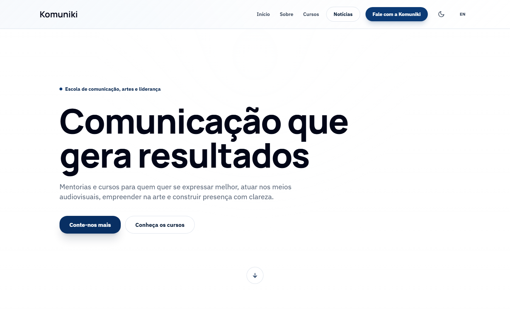
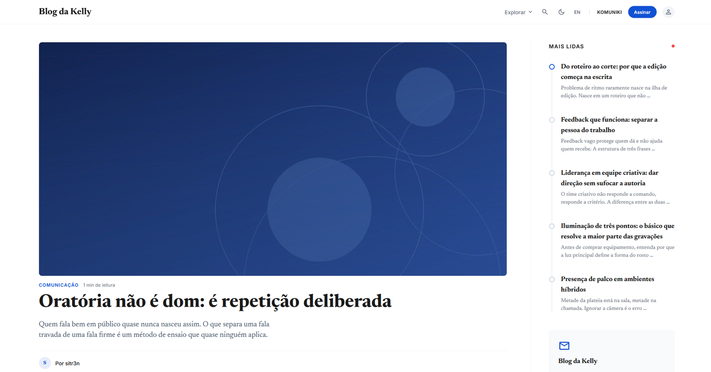
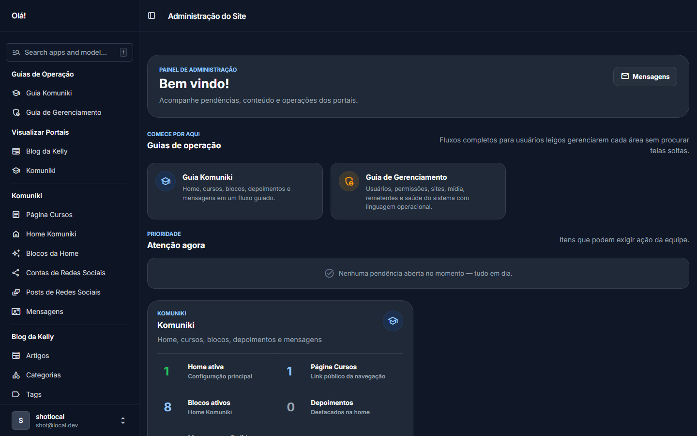
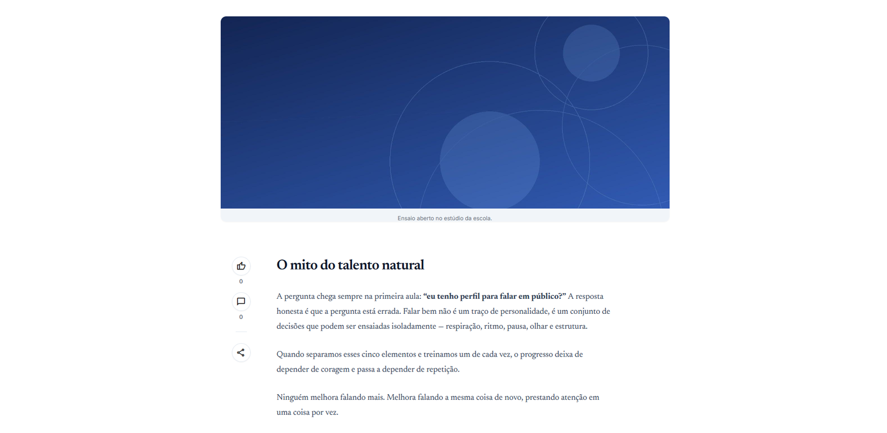

# news_portal

Portal institucional da Komuniki e portal de notícias Blog da Kelly, servidos por um único projeto Django.








---

## Status

Sistema em produção para um cliente real. O repositório está em fase de manutenção evolutiva: mudanças devem preservar segurança, operação do admin e compatibilidade com o deploy atual.

No ar: [komuniki.com.br](https://komuniki.com.br) · [kellyfarias.com.br/news/](https://kellyfarias.com.br/news/)

---

## Visão Geral

O projeto serve dois portais públicos e um painel administrativo a partir do mesmo codebase:

| Superfície | URL/prefixo | Propósito |
|------------|-------------|-----------|
| Komuniki | `/` em [komuniki.com.br](https://komuniki.com.br) | Site institucional da escola |
| Blog da Kelly | `/news/` em [kellyfarias.com.br](https://kellyfarias.com.br/news/) | Portal de notícias com artigos, RSS, comentários e newsletter |
| Admin | `/admin/` | Painel Django Unfold para operação dos dois portais |

**Ponto importante:** hoje os dois portais compartilham `SITE_ID=1`. A separação pública é por roteamento de caminho e configuração de domínio no Nginx, não por dois registros `Site` ativos. O Django Sites Framework e os managers `on_site` existem como proteção arquitetural para um futuro multi-site real.

---

## Stack

| Camada | Tecnologia |
|--------|------------|
| Backend | Python 3.12+ / Django 5.1+ |
| Banco | PostgreSQL 16 em produção |
| CMS editorial | Wagtail 7.4 — corpo dos artigos em StreamField, rascunho/revisão/preview e biblioteca de imagens |
| Frontend | Django Templates + HTMX + Alpine.js |
| Admin | Django Unfold |
| Estáticos | WhiteNoise em dev, Nginx em produção |
| Deploy | Docker Compose, Nginx, Let's Encrypt, GitHub Actions com tag aprovada |



---

## Estrutura

```text
apps/
  common/        Models abstratos, sanitização, SiteExtension, dashboard e guias
  accounts/      CustomUser, autenticação, papéis e grupos
  school/        Home, páginas, equipe, depoimentos e blocos da Komuniki
  hiring/        Vagas, departamentos e candidaturas
  contact/       Formulário de contato
  news/          Artigos em blocos, categorias, tags, newsletter, RSS, comentários
  cms_media/     Modelos de imagem e documento do Wagtail, com crédito e ponte para a mídia legada
  media_library/ Biblioteca de mídia compartilhada
  social/        Contas e posts de Instagram/TikTok, com sync opcional por API

docs/
  user/          Guias para pessoas não técnicas
  technical/     Engenharia, deploy, segurança e runbooks
  ai/            Regras para agentes de IA
```

---

## Setup Rápido

### Com Docker

```bash
git clone https://github.com/Sitr3n01/news_portal.git
cd news_portal

cp .env.example .env

docker compose -f docker/docker-compose.yml up -d
docker compose -f docker/docker-compose.yml exec web python manage.py migrate
docker compose -f docker/docker-compose.yml exec web python manage.py createsuperuser
```

Acesse:

- App: http://localhost:8000
- Admin: http://localhost:8000/admin
- Mailpit: http://localhost:8025

### Sem Docker

```bash
git clone https://github.com/Sitr3n01/news_portal.git
cd news_portal

python -m venv .venv
source .venv/bin/activate   # Windows: .venv\Scripts\activate

pip install -r requirements/development.txt
cp .env.example .env

# Alternativa rápida sem PostgreSQL local:
export DJANGO_SETTINGS_MODULE=config.settings.local_sqlite

python manage.py migrate
python manage.py createsuperuser
python manage.py runserver
```

---

## Regras Críticas

- Views públicas usam Function-Based Views e `Model.on_site`, nunca `Model.objects`.
- Conteúdo HTML de usuário passa por `apps.common.sanitization`; templates usam `sanitize_html`, nunca `safe`.
- Uploads validam extensão e MIME.
- Admins herdam de `unfold.admin.ModelAdmin` e textos visíveis ficam em PT-BR.
- Newsletter não é enviada no signal de publicação: o artigo é marcado como pendente, e o envio roda por comando ou ação no admin.
- Deploy de produção só deve seguir o fluxo de tag aprovada descrito em `docs/technical/secure-deploy.md`.

---

## Testes

```bash
ruff check .
pytest
```

436 testes, todos passando: `accounts` (223), `news` (116), `common` (44), `social` (27), `school` (10), `hiring` (7), `media_library` (5) e `contact` (4). Não há `pytest-cov` configurado, então o projeto não publica percentual de cobertura.

O CI roda lint, `collectstatic` e testes em pushes/PRs para `main` e `master`. O deploy de produção é manual, aprovado via environment `production`, e move a tag `production-approved`.

---

## Deploy

O caminho canônico de produção é `/opt/kelly_sys`, com Docker Compose project `kellysys`.

Esse caminho e esse nome de project são anteriores à renomeação do repositório e foram mantidos de propósito: alterá-los exigiria recriar volumes, containers e o checkout do servidor. A divergência em relação a `news_portal` é intencional, não resíduo.

Leia nesta ordem:

1. [docs/technical/go-live-checklist.md](docs/technical/go-live-checklist.md)
2. [docs/technical/DEPLOY.md](docs/technical/DEPLOY.md)
3. [docs/technical/secure-deploy.md](docs/technical/secure-deploy.md)
4. [docs/technical/cloudflare-bots.md](docs/technical/cloudflare-bots.md)

---

## Documentação

| Público | Comece por |
|---------|------------|
| Pessoas não técnicas | [docs/user/index.md](docs/user/index.md) |
| Desenvolvedores | [docs/technical/README.md](docs/technical/README.md) |
| Operação/deploy | [docs/technical/go-live-checklist.md](docs/technical/go-live-checklist.md) |
| Segurança | [docs/technical/SEGURANCA.md](docs/technical/SEGURANCA.md) |
| Agentes de IA | [docs/ai/README.md](docs/ai/README.md) |
| Histórico de manutenção | [docs/MAINTENANCE_HISTORY.md](docs/MAINTENANCE_HISTORY.md) |

Mapa completo: [docs/README.md](docs/README.md).

---

> **Nota histórica:** este repositório foi renomeado de `kelly_sys` para `news_portal`. Links antigos continuam funcionando por redirect do GitHub. O caminho de deploy e o Compose project preservam a nomenclatura anterior, como explicado em [Deploy](#deploy).

---

## Licença

Distribuído sob licença MIT. Veja [LICENSE](LICENSE) para detalhes.
