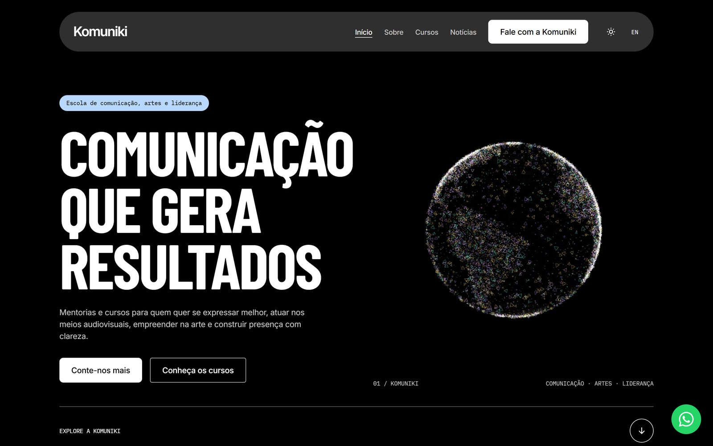
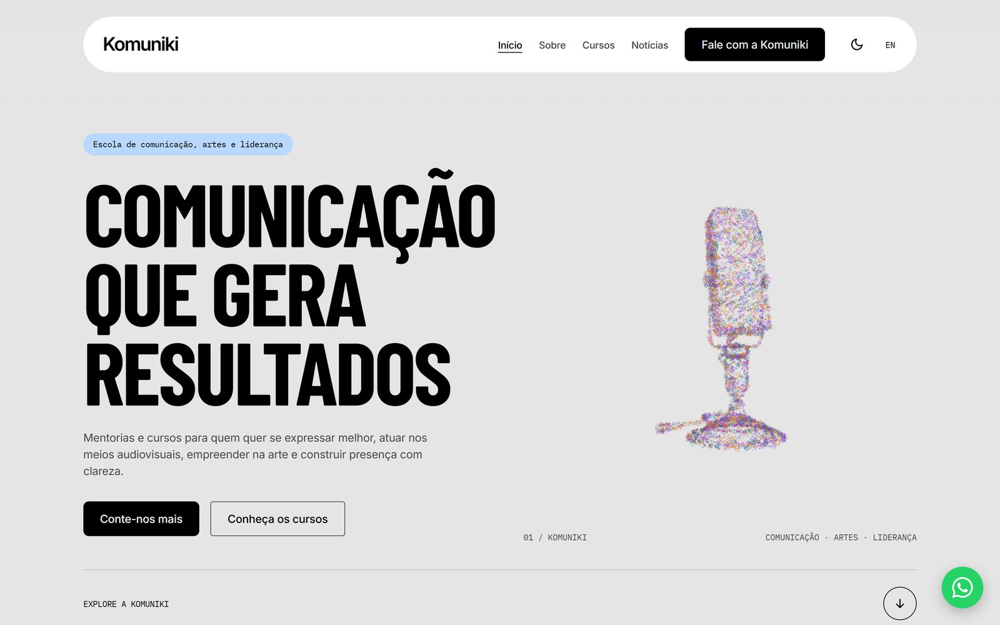
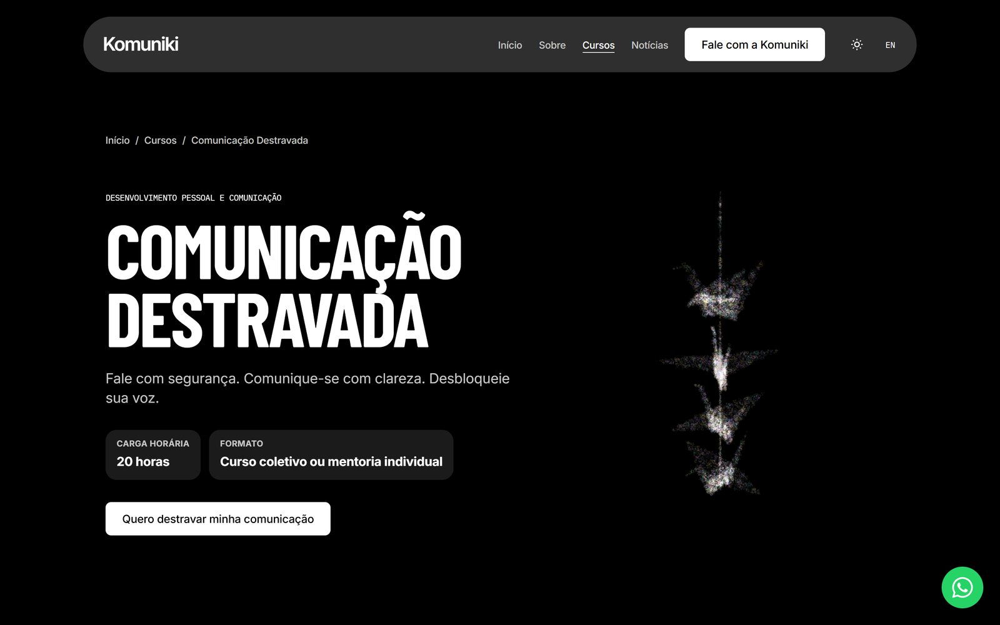
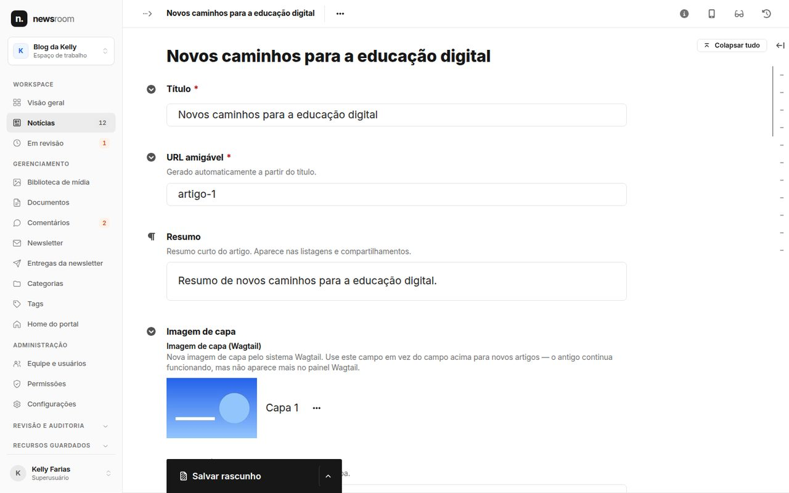
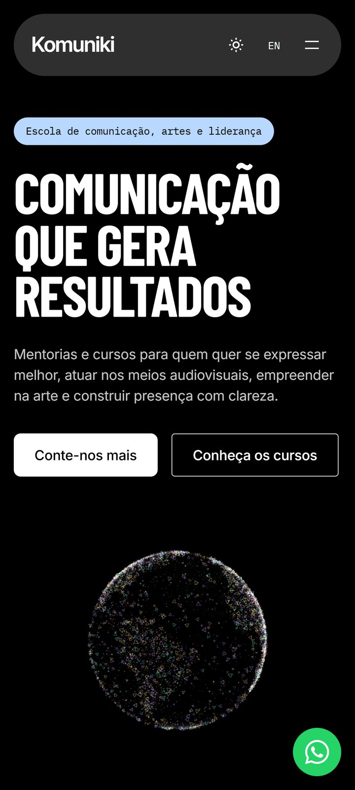
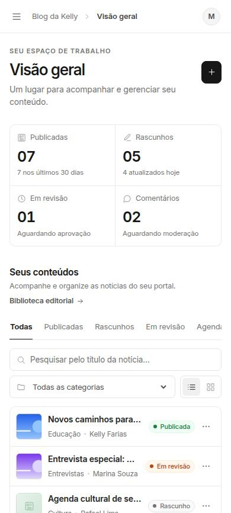
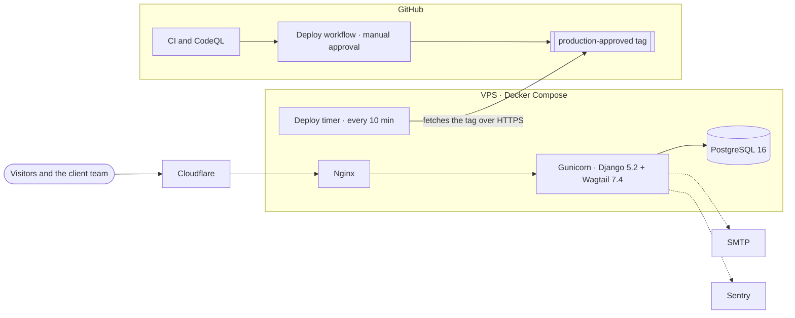

<div align="center">

# news_portal

**One Django + Wagtail codebase running two production websites and the newsroom behind them.**

[Komuniki](https://komuniki.com.br) — editorial site of a communication & arts school ·
[Blog da Kelly](https://kellyfarias.com.br/news/) — news portal ·
Newsroom — the team's admin panel

[](https://github.com/Sitr3n01/news_portal/actions/workflows/django.yml)
[](https://github.com/Sitr3n01/news_portal/actions/workflows/codeql.yml)


[](LICENSE)

**English** · [Português](README.pt-BR.md)

</div>



## What this is

A production system for a real client, built and operated end to end: data model, front end, back office, CI/CD and the VPS it runs on. In production since June 2026.

[Komuniki](https://komuniki.com.br) is a Brazilian school of communication, arts and leadership founded by journalist Kelly Farias; the [Blog da Kelly](https://kellyfarias.com.br/news/) is her news portal. Both sites, the editorial back office their team uses every day and the operations around them live in this repository.

| Surface | Where | What it does |
|---|---|---|
| **Komuniki** | [komuniki.com.br](https://komuniki.com.br) | Editorial school site: home, about, course catalog with a page per course, contact. Portuguese and English. |
| **Blog da Kelly** | [kellyfarias.com.br/news](https://kellyfarias.com.br/news/) | News portal: articles built from StreamField blocks, categories, tags, search, RSS, comments, likes, bookmarks, newsletter. |
| **Newsroom** | `/admin/` and `/cms/` | One panel over the Django admin (Unfold) and Wagtail: editorial workflow, scheduling, media, users and roles. |

## Highlights

**Motion that respects the reader**
- WebGL hero built with three.js and custom shaders: 16,000 triangles (9,000 on phones) reassemble in a loop, from an RCA 44-BX microphone to the Earth to a loose cloud. Two transparent canvases, one behind the headline and one in front, let particles cross over and under the letters. Drag to rotate, with inertia.
- Course pages get a second particle scene: a garland of origami cranes (*tsurus*).
- GSAP SplitText line reveals, an animated underline on interactive text, page fades, and a circular theme switch built on the View Transitions API on both sites.
- All of it backs off under `prefers-reduced-motion`: no loops, no split text, no fades.

**A back office the client's team actually uses**
- The Django admin and the Wagtail admin were redesigned into a single *Newsroom* panel: one sidebar, a workspace per site, shared list headers and selection bars, one editor bar and toast messages across both.
- Per-article editorial governance: reporters write, editors approve, and scheduling only ever publishes an approved revision.
- Newsletter sends are queued on publish and run from a command or an admin action, never inside the publish signal.
- Plain-language manuals for non-technical staff in [`docs/user/`](docs/user/index.md).

**Security, audited**
- A five-category audit found 7 issues (3 high, 3 medium, 1 low): privilege escalation inside the admin, IDOR on reader actions, stored XSS through uploads, CSP gaps and deploy secret placeholders. All were fixed in four sprints, each with regression tests. Report: [`docs/security-audit/`](docs/security-audit/relatorio-auditoria-seguranca.pdf).
- Nonce-based CSP on every public page. Nginx adds a baseline policy for `/admin/` and `/cms/`, and browsers enforce the intersection of the two.
- Uploads are checked by extension allowlist and MIME type, nothing executable is served from `/media/`, and résumés are only reachable through an authenticated `X-Accel-Redirect` view.
- Unified login with Google (own OAuth flow, ID token verified with `google-auth`), e-mail verification, code-based password reset, lockout with django-axes, and Cloudflare Turnstile on public forms.

**Operations on a small VPS**
- Docker Compose (Nginx, Gunicorn, PostgreSQL 16) on a 1 vCPU / 4 GB VPS behind Cloudflare.
- Pull-based deploys: a manual GitHub Actions workflow runs the checks, waits for approval on the `production` environment and moves the `production-approved` tag. The VPS polls that tag over HTTPS and deploys itself: database backup, build, migrate, eight health checks. CI holds no server credentials and nothing connects in.
- Found and fixed a deploy that had been retrying in a loop for two months and Docker images that grew quadratically with database dumps: the build cache went from **23.95 GB to 442 MB**. Write-up in [`docs/MAINTENANCE_HISTORY.md`](docs/MAINTENANCE_HISTORY.md).

**Quality gates**
- **817 tests**, with branch coverage enforced at a floor of 82% (83.4% today).
- Ruff, missing-migration check, secret scan (detect-secrets), CodeQL, pip-audit and locked dependencies. Dependabot sends one grouped update per week.
- `master` is protected: the `test` check must pass on an up-to-date branch, for admins too.

## Screenshots

| Komuniki, light theme | Course page with the origami cranes |
|---|---|
|  |  |
| **Blog da Kelly, black theme** | **Newsroom panel, Wagtail editor** |
|  |  |

<p align="center">
  
  &nbsp;&nbsp;
  
</p>

## Architecture


```mermaid
flowchart LR
    users([Visitors and the client team]) --> cf[Cloudflare]
    subgraph vps[VPS · Docker Compose]
        nginx[Nginx] --> app[Gunicorn · Django 5.2 + Wagtail 7.4]
        app --> db[(PostgreSQL 16)]
        timer[Deploy timer · every 10 min]
    end
    cf --> nginx
    app -.-> mail[SMTP]
    app -.-> sentry[Sentry]
    subgraph gh[GitHub]
        checks[CI and CodeQL] --> approve[Deploy workflow · manual approval] --> tag[[production-approved tag]]
    end
    timer -- fetches the tag over HTTPS --> tag
```

Both public sites are served by the same Django project. Nginx maps each domain to its path prefix, and public views read through Site-aware managers (`Model.on_site`), so turning on a second `Site` later cannot leak content between portals.

| App | Responsibility |
|---|---|
| `common` | Abstract models, HTML sanitization, site settings, the Newsroom panel shell, dashboards and system checks |
| `accounts` | Custom user, unified login, Google OAuth, roles and groups |
| `school` | Komuniki pages, course catalog, team and home blocks |
| `news` | Wagtail articles (StreamField), categories, tags, comments, likes, newsletter, RSS, editorial workflow |
| `cms_media` | Wagtail image and document models with credits, plus the bridge to legacy media |
| `media_library` | Shared media library for the Django admin |
| `contact` | Contact form, including the course a visitor is interested in |
| `hiring` | Job openings and applications (admin only) with protected résumé downloads |
| `social` | Instagram and TikTok accounts and posts, with optional API sync |

**Key decisions**
- **One project, two sites, one `Site` record.** Path routing plus Nginx today; the `on_site` managers keep a real multi-site setup one switch away.
- **No CDNs.** three.js, GSAP, htmx and Alpine are vendored and served by the app, which keeps the CSP at `'self'` plus a nonce.
- **The course catalog lives in code** ([`apps/school/courses.py`](apps/school/courses.py)). Fixed slugs keep shared links and the contact form's *course of interest* stable, and every text ships with its English version. The trade-off is that copy changes need a deploy; moving the catalog to Wagtail snippets is the next step if it starts changing often.
- **GitHub never connects to the server.** The VPS pulls an approved tag instead of CI pushing over SSH.

## Tech stack

| Layer | Technology |
|---|---|
| Back end | Python 3.12, Django 5.2 LTS, Wagtail 7.4 |
| Data | PostgreSQL 16 in production; SQLite for local development and the test suite |
| Front end | Django templates, HTMX, Alpine.js, Tailwind CSS, GSAP 3.15 (ScrollTrigger, SplitText), three.js r186 |
| Admin | Django Unfold and the Wagtail admin, unified as the Newsroom panel |
| Security | django-csp (nonces), django-axes, bleach, Cloudflare Turnstile, google-auth |
| Infrastructure | Docker Compose, Nginx, Gunicorn, WhiteNoise, Let's Encrypt, Cloudflare, Sentry |
| CI/CD | GitHub Actions, CodeQL, Dependabot, detect-secrets, pip-audit, uv-compiled lock files |

## Getting started

Quick start with SQLite (no PostgreSQL needed):

```bash
git clone https://github.com/Sitr3n01/news_portal.git
cd news_portal
python -m venv .venv
source .venv/bin/activate        # Windows: .venv\Scripts\activate
pip install -r requirements/development.txt
cp .env.example .env
export DJANGO_SETTINGS_MODULE=config.settings.local_sqlite   # Windows: $env:DJANGO_SETTINGS_MODULE = "config.settings.local_sqlite"
python manage.py migrate
python manage.py createsuperuser
python manage.py runserver
```

With Docker (PostgreSQL and Mailpit included):

```bash
cp .env.example .env
docker compose -f docker/docker-compose.yml up -d
docker compose -f docker/docker-compose.yml exec web python manage.py migrate
docker compose -f docker/docker-compose.yml exec web python manage.py createsuperuser
```

The app runs at http://localhost:8000, the admin at http://localhost:8000/admin and Mailpit at http://localhost:8025.

Checks, the same ones CI runs:

```bash
ruff check .
pytest --cov
```

## Documentation

The documentation is written in Portuguese, the language of the client's team.

| For | Start here |
|---|---|
| Non-technical staff | [docs/user/index.md](docs/user/index.md) |
| Developers | [docs/technical/README.md](docs/technical/README.md) · [CONTRIBUTING.md](CONTRIBUTING.md) |
| Deploy and operations | [go-live checklist](docs/technical/go-live-checklist.md) · [DEPLOY.md](docs/technical/DEPLOY.md) · [secure-deploy.md](docs/technical/secure-deploy.md) |
| Security | [SEGURANCA.md](docs/technical/SEGURANCA.md) · [security audit](docs/security-audit/) · [SECURITY.md](.github/SECURITY.md) |
| AI coding agents | [docs/ai/README.md](docs/ai/README.md) |
| History | [CHANGELOG.md](CHANGELOG.md) · [maintenance history](docs/MAINTENANCE_HISTORY.md) |

## How it's built

Development uses AI coding agents (Claude Code and Codex) as pair programmers. The rules they follow are versioned in [`docs/ai/`](docs/ai/README.md), and every change still lands through a pull request that has to pass the required checks; what ships is the maintainer's call.

## Roadmap

- Run the test suite against PostgreSQL in CI, matching production.
- Migrate to Wagtail 8 and re-sync the Unfold sidebar override so both can leave their pins.
- Move the course catalog to Wagtail snippets if the school starts editing it often.

## Project history

The repository was renamed from `kelly_sys` to `news_portal`; old links redirect. The production path (`/opt/kelly_sys`) and the Compose project name (`kellysys`) keep the old name on purpose, since renaming them would mean recreating volumes and containers. Releases and notes: [CHANGELOG.md](CHANGELOG.md).

## License

The code is released under the [MIT License](LICENSE). The Komuniki and Blog da Kelly names, logos, photos and texts belong to their owners and are not covered by it.

Built and maintained by José Gilberto ([@Sitr3n01](https://github.com/Sitr3n01)).
