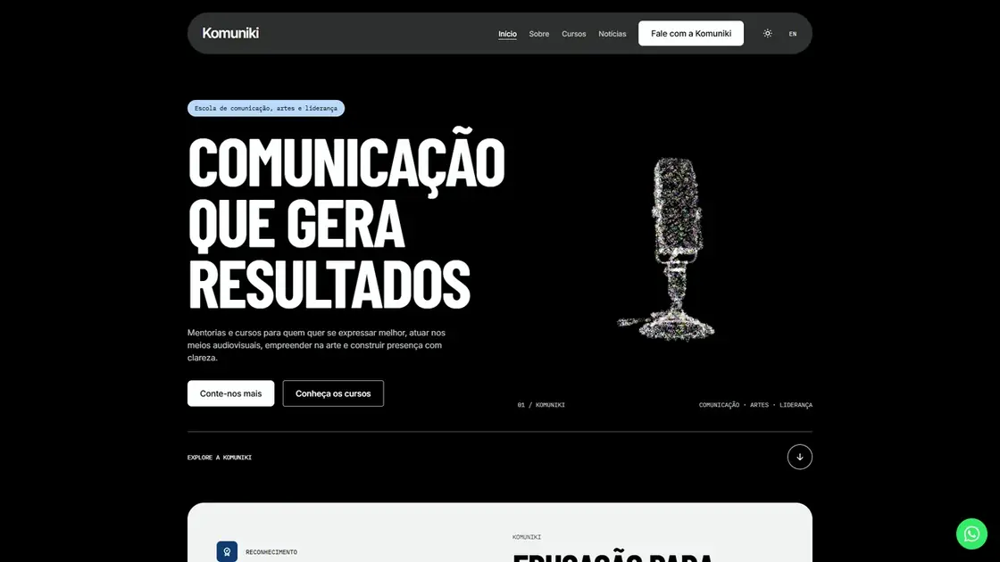
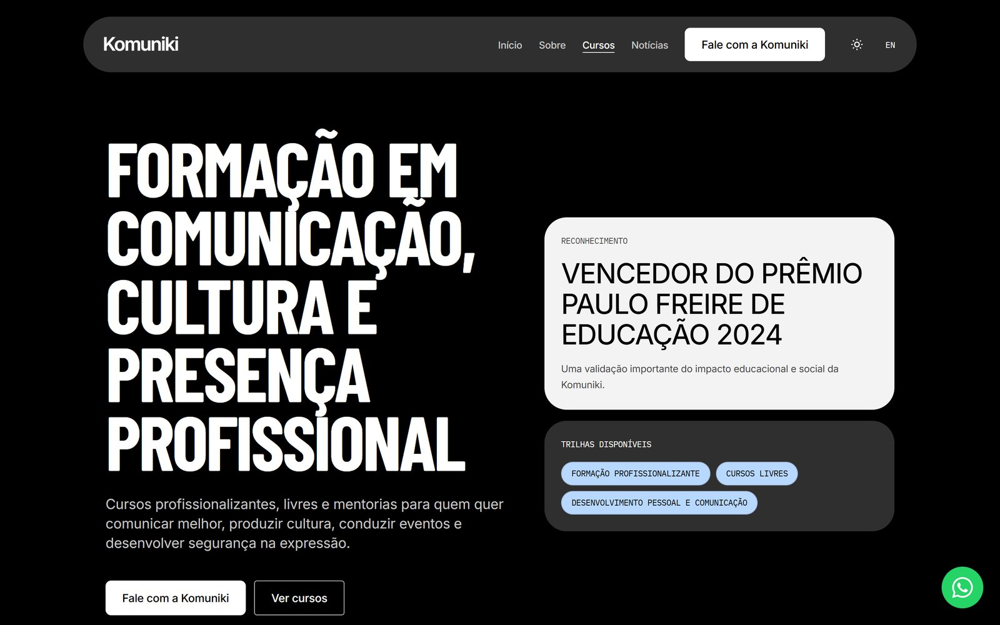
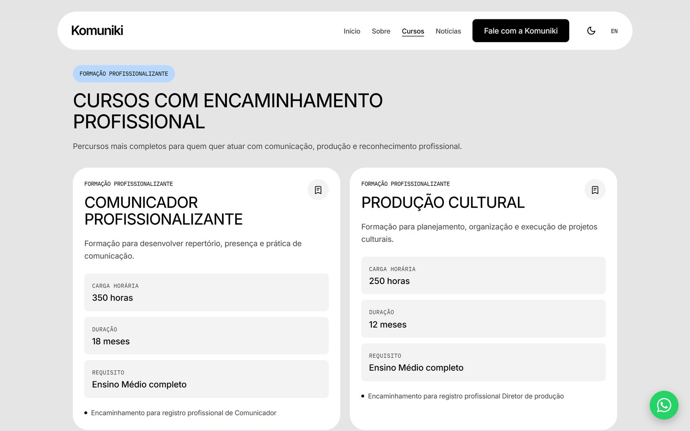
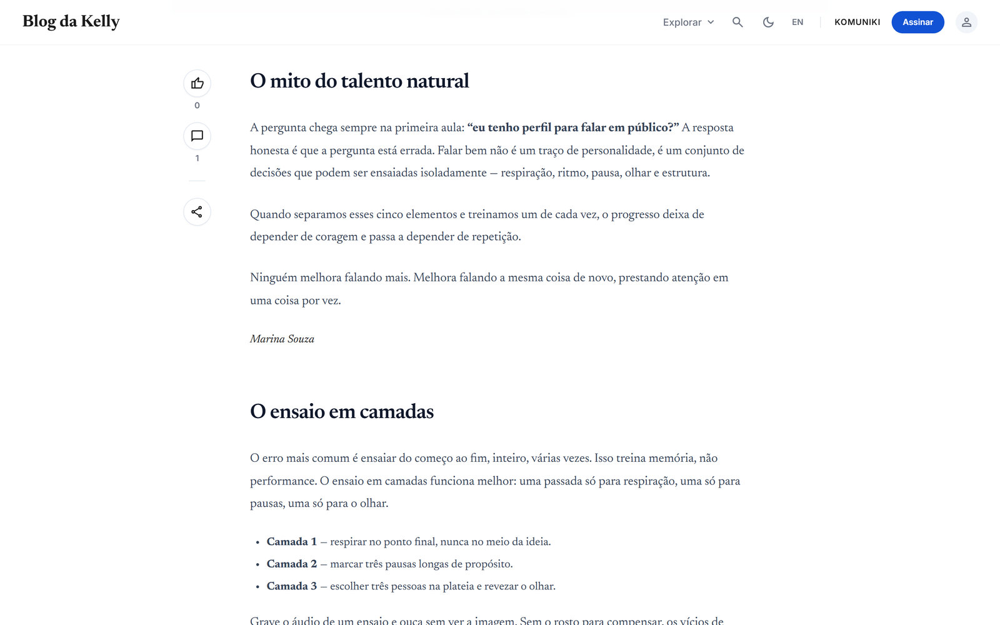
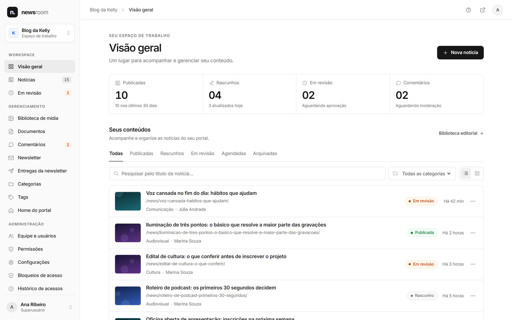
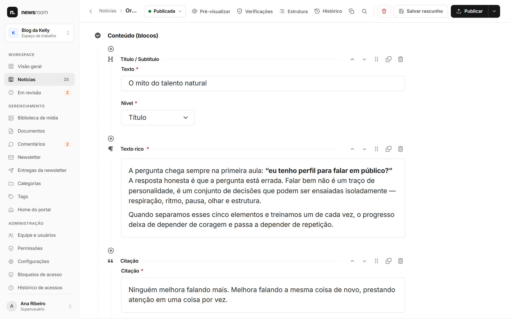
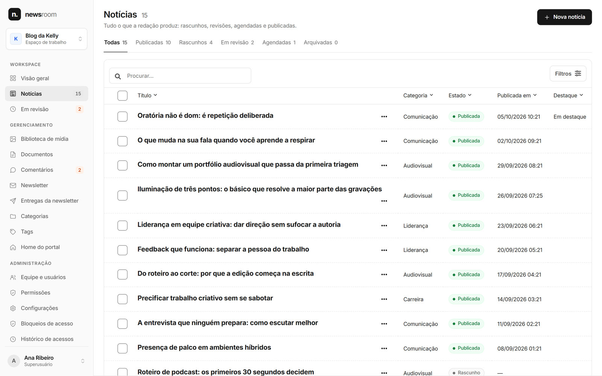
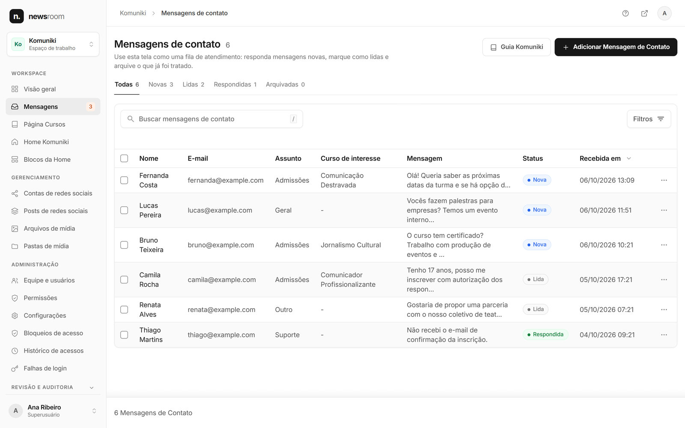
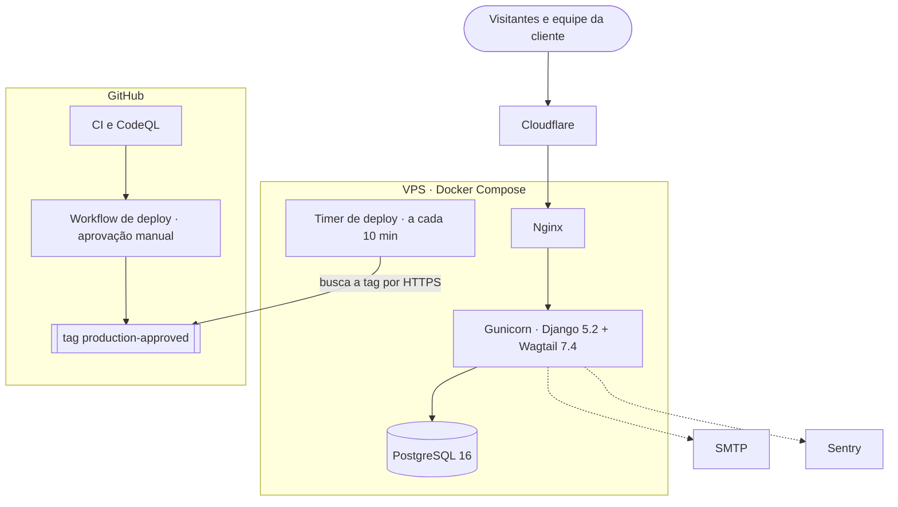

<div align="center">

# news_portal

**Um único código Django + Wagtail rodando dois sites em produção e a redação por trás deles.**

[Komuniki](https://komuniki.com.br) — site editorial de uma escola de comunicação e artes ·
[Blog da Kelly](https://kellyfarias.com.br/news/) — portal de notícias ·
Newsroom — o painel da equipe

[](https://github.com/Sitr3n01/news_portal/actions/workflows/django.yml)
[](https://github.com/Sitr3n01/news_portal/actions/workflows/codeql.yml)


[](LICENSE)
[](https://github.com/Sitr3n01/news_portal/releases)

[English](README.md) · **Português**

</div>

[](https://komuniki.com.br)

<p align="center"><sub>Trecho de 26 segundos gravado no site da Komuniki no ar.</sub></p>

## O que é

Um sistema em produção para um cliente real, construído e operado de ponta a ponta: modelagem de dados, front-end, painel administrativo, CI/CD e a VPS onde ele roda. No ar desde junho de 2026.

A [Komuniki](https://komuniki.com.br) é uma escola de comunicação, artes e liderança criada pela jornalista Kelly Farias; o [Blog da Kelly](https://kellyfarias.com.br/news/) é o portal de notícias dela. Os dois sites, o painel editorial que a equipe usa todo dia e a operação em volta deles estão neste repositório.

| Superfície | Onde | O que faz |
|---|---|---|
| **Komuniki** | [komuniki.com.br](https://komuniki.com.br) | Site editorial da escola: início, sobre, catálogo com uma página por curso e contato. Em português e inglês. |
| **Blog da Kelly** | [kellyfarias.com.br/news](https://kellyfarias.com.br/news/) | Portal de notícias: artigos montados em blocos do StreamField, categorias, tags, busca, RSS, comentários, curtidas, favoritos e newsletter. |
| **Newsroom** | `/admin/` e `/cms/` | Um painel só sobre o Django admin (Unfold) e o Wagtail: fluxo editorial, agendamento, mídia, usuários e papéis. |

## Destaques

**Movimento que respeita quem lê**
- Hero em WebGL com three.js e shaders próprios: 16 mil triângulos (9 mil no celular) se remontam em loop, de um microfone RCA 44-BX para a Terra e para uma nuvem dispersa. Dois canvases transparentes, um atrás do título e outro na frente, deixam as partículas cruzarem por cima e por baixo das letras. Arrastar gira a forma, com inércia.
- As páginas de curso têm uma segunda cena de partículas: uma guirlanda de tsurus.
- Reveal de texto por linha com GSAP SplitText, sublinhado animado no texto interativo, fade entre páginas e troca de tema em círculo com a View Transitions API, nos dois sites.
- Tudo isso recua com `prefers-reduced-motion`: sem loop, sem texto dividido, sem fade.

**Um painel que a equipe da cliente usa de verdade**
- O Django admin e o admin do Wagtail foram redesenhados como um painel só, o *Newsroom*: uma barra lateral, um espaço de trabalho por site, cabeçalhos de lista e barras de seleção comuns, uma barra de edição e mensagens em toast nos dois.
- Governança editorial por notícia: o repórter escreve, o editor aprova, e o agendamento só publica uma revisão aprovada.
- O envio da newsletter entra numa fila ao publicar e roda por comando ou ação do admin, nunca dentro do signal de publicação.
- Manuais em linguagem simples para quem não é técnico, em [`docs/user/`](docs/user/index.md).

**Segurança auditada**
- Uma auditoria em cinco categorias achou 7 problemas (3 altos, 3 médios, 1 baixo): escalada de privilégio dentro do admin, IDOR em ações do leitor, XSS armazenado por upload, brechas de CSP e placeholders de segredo no deploy. Todos foram corrigidos em quatro sprints, cada um com teste de regressão. Relatório: [`docs/security-audit/`](docs/security-audit/relatorio-auditoria-seguranca.pdf).
- CSP com nonce em toda página pública. O Nginx soma uma política de base para `/admin/` e `/cms/`, e o navegador aplica a interseção das duas.
- Uploads passam por lista de extensões e checagem de MIME, nada executável sai de `/media/`, e currículos só são baixados por uma view autenticada com `X-Accel-Redirect`.
- Login unificado com Google (fluxo OAuth próprio, ID token validado com `google-auth`), verificação de e-mail, troca de senha por código, bloqueio por tentativas com django-axes e Cloudflare Turnstile nos formulários públicos.

**Operação numa VPS pequena**
- Docker Compose (Nginx, Gunicorn, PostgreSQL 16) numa VPS de 1 vCPU e 4 GB, atrás do Cloudflare.
- Deploy puxado pela VPS: um workflow manual do GitHub Actions roda as verificações, espera a aprovação do environment `production` e move a tag `production-approved`. A VPS consulta essa tag por HTTPS e faz o deploy sozinha: backup do banco, build, migrate e oito healthchecks. O CI não guarda credencial do servidor e nada se conecta a ele.
- Diagnóstico e correção de um deploy que ficou dois meses repetindo em loop e de imagens Docker que cresciam de forma quadrática com os dumps do banco: o cache de build caiu de **23,95 GB para 442 MB**. Relato em [`docs/MAINTENANCE_HISTORY.md`](docs/MAINTENANCE_HISTORY.md).

**Travas de qualidade**
- **823 testes**, com cobertura de branches exigida a partir de 82% (hoje, 83,5%).
- Ruff, checagem de migration faltando, varredura de segredos (detect-secrets), CodeQL, pip-audit e dependências travadas. O Dependabot manda uma atualização agrupada por semana.
- O `master` é protegido: o check `test` precisa passar com a branch em dia, inclusive para administradores.

## Telas

### Komuniki

| Início, tema claro | Catálogo de cursos |
|---|---|
|  |  |
| **Cursos profissionalizantes** | **Página de curso com os tsurus** |
|  |  |

### Blog da Kelly

| Início, tema preto | Notícia montada com blocos do StreamField |
|---|---|
|  |  |

### Newsroom

| Visão geral do espaço Blog da Kelly | Editor de blocos (Wagtail) |
|---|---|
|  |  |
| **Biblioteca de notícias (Wagtail)** | **Mensagens de contato (Django admin)** |
|  |  |

<p align="center">
  
  &nbsp;&nbsp;
  
</p>

<sub>A Komuniki e a home do Blog da Kelly são capturas do site no ar. As telas do Newsroom e a página de notícia rodam localmente, com dados fictícios de demonstração: todo nome, mensagem e notícia nelas é inventado.</sub>

## Arquitetura



Os dois sites públicos saem do mesmo projeto Django. O Nginx associa cada domínio ao seu prefixo de caminho, e as views públicas leem por managers ligados ao `Site` (`Model.on_site`): ativar um segundo `Site` no futuro não vaza conteúdo entre os portais.

| App | Responsabilidade |
|---|---|
| `common` | Models abstratos, sanitização de HTML, configurações do site, a casca do painel Newsroom, dashboards e system checks |
| `accounts` | Usuário customizado, login unificado, OAuth do Google, papéis e grupos |
| `school` | Páginas da Komuniki, catálogo de cursos, equipe e blocos da home |
| `news` | Notícias no Wagtail (StreamField), categorias, tags, comentários, curtidas, newsletter, RSS e fluxo editorial |
| `cms_media` | Models de imagem e documento do Wagtail com crédito, e a ponte para a mídia legada |
| `media_library` | Biblioteca de mídia compartilhada do Django admin |
| `contact` | Formulário de contato, com o curso de interesse do visitante |
| `hiring` | Vagas e candidaturas (só no admin), com download protegido de currículos |
| `social` | Contas e posts de Instagram e TikTok, com sincronização opcional pela API |

**Decisões principais**
- **Um projeto, dois sites, um registro `Site`.** Hoje, roteamento por caminho mais Nginx; os managers `on_site` deixam o multi-site real a uma chave de distância.
- **Sem CDN.** three.js, GSAP, htmx e Alpine são vendorizados e servidos pela aplicação, e o Tailwind é compilado em CSS estático no build, o que mantém a CSP em `'self'` mais um nonce.
- **O catálogo de cursos fica no código** ([`apps/school/courses.py`](apps/school/courses.py)). Os slugs fixos mantêm estáveis os links compartilhados e o *curso de interesse* do formulário de contato, e todo texto vem com a versão em inglês. A contrapartida é que mudar um texto exige deploy; se o catálogo passar a mudar com frequência, o próximo passo é levá-lo para snippets do Wagtail.
- **O GitHub nunca se conecta ao servidor.** A VPS puxa uma tag aprovada, em vez de o CI empurrar por SSH.

## Stack

| Camada | Tecnologia |
|---|---|
| Back-end | Python 3.12, Django 5.2 LTS, Wagtail 7.4 |
| Dados | PostgreSQL 16 em produção; SQLite no desenvolvimento local e na suíte de testes |
| Front-end | Templates Django, HTMX, Alpine.js, Tailwind CSS, GSAP 3.15 (ScrollTrigger, SplitText), three.js r186 |
| Admin | Django Unfold e o admin do Wagtail, unificados no painel Newsroom |
| Segurança | django-csp (nonce), django-axes, bleach, Cloudflare Turnstile, google-auth |
| Infraestrutura | Docker Compose, Nginx, Gunicorn, WhiteNoise, Let's Encrypt, Cloudflare, Sentry |
| CI/CD | GitHub Actions, CodeQL, Dependabot, detect-secrets, pip-audit, locks gerados com uv |

## Como rodar

Começo rápido com SQLite (sem PostgreSQL):

```bash
git clone https://github.com/Sitr3n01/news_portal.git
cd news_portal
python -m venv .venv
source .venv/bin/activate        # Windows: .venv\Scripts\activate
pip install -r requirements/development.txt
cp .env.example .env
export DJANGO_SETTINGS_MODULE=config.settings.local_sqlite   # Windows: $env:DJANGO_SETTINGS_MODULE = "config.settings.local_sqlite"
python manage.py migrate
python manage.py createsuperuser
python manage.py runserver
```

Com Docker (PostgreSQL e Mailpit inclusos):

```bash
cp .env.example .env
docker compose -f docker/docker-compose.yml up -d
docker compose -f docker/docker-compose.yml exec web python manage.py migrate
docker compose -f docker/docker-compose.yml exec web python manage.py createsuperuser
```

A aplicação fica em http://localhost:8000, o admin em http://localhost:8000/admin e o Mailpit em http://localhost:8025.

As mesmas verificações do CI:

```bash
ruff check .
pytest --cov
```

## Documentação

| Para | Comece por |
|---|---|
| Quem não é técnico | [docs/user/index.md](docs/user/index.md) |
| Desenvolvimento | [docs/technical/README.md](docs/technical/README.md) · [CONTRIBUTING.md](CONTRIBUTING.md) |
| Deploy e operação | [checklist de go-live](docs/technical/go-live-checklist.md) · [DEPLOY.md](docs/technical/DEPLOY.md) · [secure-deploy.md](docs/technical/secure-deploy.md) |
| Segurança | [SEGURANCA.md](docs/technical/SEGURANCA.md) · [auditoria de segurança](docs/security-audit/) · [SECURITY.md](.github/SECURITY.md) |
| Agentes de IA | [docs/ai/README.md](docs/ai/README.md) |
| Histórico | [CHANGELOG.md](CHANGELOG.md) · [histórico de manutenção](docs/MAINTENANCE_HISTORY.md) |

## Como é feito

O desenvolvimento usa agentes de código com IA (Claude Code e Codex) como pares de programação. As regras que eles seguem estão versionadas em [`docs/ai/`](docs/ai/README.md), e toda mudança entra por pull request e precisa passar pelas verificações obrigatórias; o que vai para produção é decisão do mantenedor.

## Próximos passos

- Rodar a suíte de testes contra PostgreSQL no CI, como em produção ([#66](https://github.com/Sitr3n01/news_portal/issues/66)).
- Migrar para o Wagtail 8 e re-sincronizar o override da sidebar do Unfold, para que os dois saiam dos pins ([#67](https://github.com/Sitr3n01/news_portal/issues/67)).
- Levar o catálogo de cursos para snippets do Wagtail se a escola passar a editá-lo com frequência ([#68](https://github.com/Sitr3n01/news_portal/issues/68)).

## Histórico do projeto

O repositório foi renomeado de `kelly_sys` para `news_portal`; links antigos redirecionam. O caminho de produção (`/opt/kelly_sys`) e o nome do projeto Compose (`kellysys`) mantêm o nome antigo de propósito, porque renomeá-los exigiria recriar volumes e containers. Versões e notas: [CHANGELOG.md](CHANGELOG.md).

## Licença

O código está sob a [licença MIT](LICENSE). Os nomes, logotipos, fotos e textos da Komuniki e do Blog da Kelly pertencem aos seus donos e não estão cobertos por ela.

Construído e mantido por José Gilberto ([@Sitr3n01](https://github.com/Sitr3n01)).
