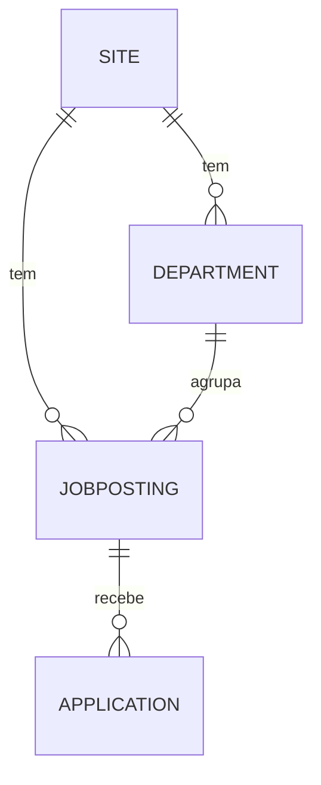
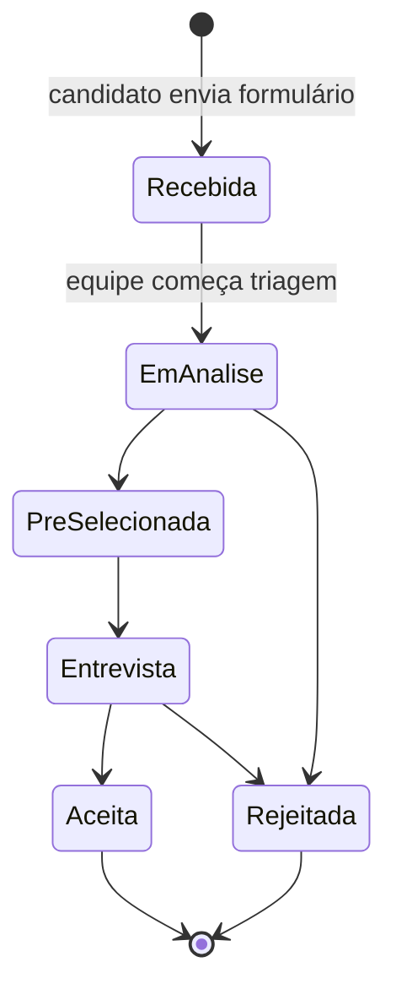
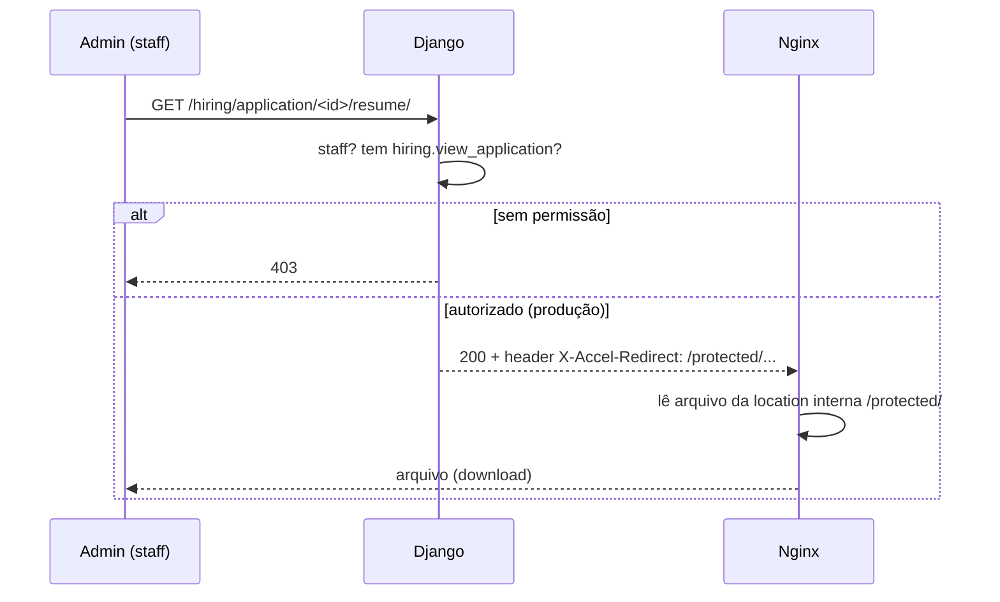

# App `hiring` — Vagas e Candidaturas

> Como funcionam departamentos, vagas e candidaturas: do formulário público até o download protegido de currículos no admin.
>
> Documentos relacionados: [ARQUITETURA_E_MODELOS.md](ARQUITETURA_E_MODELOS.md) · [SEGURANCA.md](SEGURANCA.md)

---

## 1. Visão geral

O app `hiring` é o "Trabalhe conosco" da escola. Está montado em `/hiring/`, mas no admin aparece sob **Portal Escolar** (conceitualmente pertence à escola). Três modelos:



| Modelo | Isolado por site? | Papel |
|--------|:-----------------:|-------|
| `Department` | ✅ `ForeignKey(Site)` + `on_site` | Áreas (Pedagógico, Administrativo, …) |
| `JobPosting` | ✅ `ForeignKey(Site)` + `on_site` | A vaga em si, com fluxo de status |
| `Application` | herda da vaga | Candidatura (dados do candidato + currículo) |

> **Correção importante:** documentação antiga afirmava que vagas eram "globais, sem `Site`". **Não é verdade no código atual** — `Department` e `JobPosting` têm `ForeignKey(Site)` e `on_site` (migration `0006_site_isolation`). `Application` não tem `Site` próprio porque o site é determinado pela vaga.

---

## 2. Modelos em detalhe

### `Department` — `apps/hiring/models.py`
- `site`, `name`, `slug`.
- `constraints`: `UniqueConstraint(['site', 'slug'])` — slug único **por site**.
- Managers: `objects` + `on_site`.

### `JobPosting`
Herda `TimeStampedModel` + `SEOModel`.

| Campo | Observação |
|-------|------------|
| `site`, `department` | A vaga pertence a um site e a um departamento |
| `title`, `slug` | Slug único por site (`unique_job_posting_slug_per_site`) |
| `description`, `requirements` | Conteúdo da vaga |
| `employment_type` | `full_time` / `part_time` / `contract` / `internship` |
| `status` | `draft` (não visível) / `open` (no site) / `closed` (fora do site) |
| `published_at` | Carimbado ao abrir a vaga |
| `deadline` | Prazo final para candidaturas |

**Validação de integridade multi-site** — `JobPosting.clean()`:

```python
if self.department.site_id != self.site_id:
    raise ValidationError({'department': 'O departamento deve pertencer ao mesmo site da vaga.'})
```

Isso impede associar uma vaga do site A a um departamento do site B.

### `Application`
Herda `TimeStampedModel`.

| Campo | Observação |
|-------|------------|
| `job` | FK para a vaga (define o site implicitamente) |
| `first_name`, `last_name`, `email`, `phone` | Dados do candidato |
| `cover_letter` | Carta de apresentação (opcional) |
| `resume` | Arquivo — **nome gerado via UUID** (ver seção 4) |
| `status` | Pipeline de triagem (ver seção 3) |
| `notes` | Notas internas, **não visíveis ao candidato** |

---

## 3. Ciclo de vida de uma candidatura



Os status (`Application.Status`): `received → reviewing → shortlisted → interview → rejected/accepted`.

No admin ([`apps/hiring/admin.py`](../../apps/hiring/admin.py)), as transições mais comuns têm **ações em lote**: "Marcar como Em Análise", "Marcar como Aceito", "Marcar como Rejeitado". Filtros rápidos levam direto a Recebidas / Em análise / Entrevista.

---

## 4. Fluxo público: candidatar-se

Em [`apps/hiring/views.py`](../../apps/hiring/views.py):

### `job_list` — `/hiring/`
Lista apenas vagas **abertas** do site atual:
```python
JobPosting.on_site.select_related('department').filter(site=request.site, status=OPEN)
```

### `job_detail` — `/hiring/<slug>/`
Mostra a vaga e processa o formulário de candidatura (`ApplicationForm`). Lógica de submissão:

```python
if form.is_valid():
    email = form.cleaned_data['email']
    if not Application.objects.filter(job=job, email=email).exists():
        application = form.save(commit=False)
        application.job = job
        application.save()
    messages.success(request, 'Sua candidatura foi enviada com sucesso!')
    return redirect('hiring:job_detail', slug=job.slug)
```

**Detalhe de segurança/UX:** se já existe candidatura com aquele e-mail para aquela vaga, o sistema **silenciosamente não cria duplicata** — mas mostra a **mesma mensagem de sucesso**. Isso evita revelar a um terceiro se um e-mail já se candidatou (anti-enumeration), sem atrapalhar o candidato legítimo.

---

## 5. Currículos: o ponto mais sensível

Currículos são dados pessoais (LGPD) e não podem vazar por URL adivinhável. O sistema protege isso em **três camadas**.

### Camada 1 — Nome de arquivo imprevisível
[`resume_upload_path`](../../apps/hiring/models.py) gera o nome com UUID:
```python
def resume_upload_path(instance, filename):
    return f'hiring/resumes/{uuid.uuid4().hex}{Path(filename).suffix.lower()}'
```
Assim o caminho não deriva do nome do candidato — ninguém adivinha `joao-silva.pdf`.

### Camada 2 — Validação de upload (`ApplicationForm.clean_resume`)
Em [`apps/hiring/forms.py`](../../apps/hiring/forms.py), três checagens em sequência:

1. **Tipo MIME declarado** ∈ `{pdf, msword, docx}`.
2. **Extensão** ∈ `{.pdf, .doc, .docx}`.
3. **Assinatura real do arquivo (magic bytes)** — lê os primeiros bytes e confere:
   - `%PDF-` → PDF
   - `PK\x03\x04` → `.docx` (é um zip)
   - `\xd0\xcf\x11\xe0` → `.doc` (formato OLE2)

A checagem 3 é o que realmente importa: o tipo MIME e a extensão são **falsificáveis** pelo cliente; os magic bytes não. Limite de tamanho: **5 MB**.

### Camada 3 — Download protegido (nunca direto de `/media/`)
A view [`download_resume`](../../apps/hiring/views.py) é a **única** porta para baixar um currículo:

```python
@staff_member_required
@permission_required('hiring.view_application', raise_exception=True)
def download_resume(request, application_id):
    ...
    if settings.DEBUG:
        return FileResponse(...)           # dev: serve direto
    response['X-Accel-Redirect'] = f'/protected/{application.resume.name}'  # prod: nginx serve
    return response
```

- **Exige** estar logado como staff **e** ter a permissão `hiring.view_application`.
- **Em produção** usa `X-Accel-Redirect`: o Django autoriza, mas quem entrega o arquivo é o nginx, a partir de uma *location interna* (`/protected/`). O Django não fica segurando bytes de arquivo.
- **Em desenvolvimento** (sem nginx) cai para `FileResponse`.

No [`nginx.conf`](../../docker/nginx/nginx.conf), o acesso público direto é **bloqueado**:
```nginx
location /protected/            { internal; alias /app/media/; }   # só acessível via X-Accel
location /media/hiring/resumes/ { internal; }                      # bloqueia acesso direto
location /media/                { alias /app/media/; expires 7d; } # resto da mídia é público
```

### Sequência completa do download



No admin, o link "Baixar currículo" (`resume_link` em `ApplicationAdmin`) aponta para essa view — nunca para `/media/` diretamente.

---

## 6. URLs do app

[`apps/hiring/urls.py`](../../apps/hiring/urls.py):

| Rota | View | Acesso |
|------|------|--------|
| `/hiring/` | `job_list` | Público |
| `/hiring/application/<id>/resume/` | `download_resume` | Staff + permissão |
| `/hiring/<slug>/` | `job_detail` | Público (catch-all, por último) |

> A rota de download fica **antes** do catch-all `<slug:slug>/`, senão "application" seria interpretado como slug de vaga.

---

## 7. Checklist mental ao mexer no hiring

- [ ] Vaga não aparece no site? Confira `status=open` e se a view usa `on_site` com `site=request.site`.
- [ ] Erro ao salvar vaga? Pode ser `clean()` — departamento de outro site.
- [ ] Currículo não baixa em produção? Verifique a location `/protected/` no nginx e o header `X-Accel-Redirect`.
- [ ] Upload recusado? A validação por magic bytes rejeita arquivos cujo conteúdo não bate com PDF/Word, mesmo com extensão correta.
- [ ] Candidatura "sumiu"? Pode ser duplicata silenciosa (mesmo e-mail + mesma vaga).

---

_Última atualização: 2026-06-03 — gerado a partir de leitura direta do código._
