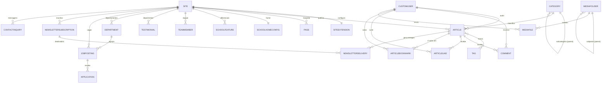

# Arquitetura e Modelos de Dados — news_portal

> Visão de conjunto para reencontrar a lógica do sistema: como um único projeto Django serve três "rostos" (admin, portal de notícias, site da escola), como um request percorre o sistema e como os modelos se relacionam.
>
> Documentos relacionados: [FLUXO_NEWSLETTER.md](FLUXO_NEWSLETTER.md) · [APP_HIRING.md](APP_HIRING.md) · [SEGURANCA.md](SEGURANCA.md)

---

## 1. A ideia central: um cérebro, três rostos

É **um único projeto Django** que serve três coisas que parecem separadas, mas compartilham banco, admin e código:

| Rosto | Prefixo de URL | Apps que o sustentam |
|-------|----------------|----------------------|
| **Site da Escola** | `/` (raiz) | `school` (+ `hiring`, `contact`) |
| **Portal de Notícias** | `/news/` | `news` |
| **Painel Admin** | `/admin/` | Django Unfold + `common` (dashboard e guias) |

O que decide qual rosto aparece é o **roteamento por caminho** (path-based routing), em [`config/urls.py`](../../config/urls.py).

```
/healthz/   → healthcheck (isento de redirect HTTPS)
/i18n/      → troca de idioma (pt-br / en)
/admin/     → painel administrativo (Unfold) + guias de operação
/sitemap.xml→ sitemap combinado (artigos + páginas)
/hiring/    → vagas e candidaturas
/contact/   → formulário de contato
/news/      → portal de notícias
/accounts/  → login, registro, recuperação de senha, conta
/           → site da escola  (CATCH-ALL — precisa ser o último)
```

**Por que a ordem importa:** a escola está montada na raiz (`path('')`). Django testa as rotas de cima para baixo e para na primeira que casa, então a escola precisa ser a última — senão "engoliria" `/news/`, `/admin/`, etc. O mesmo princípio se repete dentro de cada app: tanto `news/urls.py` quanto `school/urls.py` terminam com `<slug:slug>/`, um curinga que casa com qualquer texto e por isso fica por último.

---

## 2. O conceito multi-site (e por que ele pode confundir)

Quase todo modelo de conteúdo tem um `ForeignKey(Site)` e um manager `on_site`. Isso sugere vários sites rodando — mas **hoje o sistema roda um site só**:

- Em [`base.py`](../../config/settings/base.py) está fixo `SITE_ID = 1`.
- O manager `on_site = CurrentSiteManager()` filtra os registros para `site_id = SITE_ID`, ou seja, sempre o site 1.

A separação escola/notícias **não** é por site — é por caminho de URL (`/` vs `/news/`). O framework de Sites está **pronto, mas dormente**: no dia em que existirem domínios separados (`escola.com.br`, `noticias.com.br`), cria-se um `Site #2`, aponta-se o DNS e o mesmo código passa a servir conteúdos diferentes por domínio, sem reescrita.

### `objects` vs `on_site` — a regra de ouro

| Manager | O que retorna | Onde usar |
|---------|---------------|-----------|
| `Model.objects` | Registros de **todos** os sites | Admin, migrations, comandos administrativos |
| `Model.on_site` | Apenas registros do site atual (`SITE_ID`) | **Views públicas, feeds, sitemaps** |

Usar `objects` numa view pública é um risco de vazamento entre portais quando o segundo site existir. O checklist do projeto trata isso como item de segurança.

---

## 3. Ciclo de vida de um request

```
Browser
  │
  ▼
MIDDLEWARE (ordem importa — ver tabela abaixo)
  │  Segurança → WhiteNoise (estáticos) → Sessão → Locale → Common →
  │  CSRF → Auth → Messages → Clickjacking → CurrentSite → HTMX → Axes → CSP
  │
  ▼
CurrentSiteMiddleware  →  define request.site (= Site #1 hoje)
  │
  ▼
config/urls.py  →  escolhe o app pelo prefixo da URL
  │
  ▼
View do app (FBV)  →  consulta com .on_site (isola por site)
  │
  ▼
Context processors  →  injetam site_settings + nav em TODO template
  │
  ▼
Template (base.html / base_news.html / base_school.html)  →  HTML
```

### Cadeia de middleware (definida em `base.py`)

| # | Middleware | Papel |
|---|-----------|-------|
| 1 | `SecurityMiddleware` | Headers de segurança, redirect HTTPS, HSTS |
| 2 | `WhiteNoiseMiddleware` | Serve arquivos estáticos sem passar pela view |
| 3 | `SessionMiddleware` | Habilita `request.session` |
| 4 | `LocaleMiddleware` | Detecta idioma (pt-br padrão) |
| 5 | `CommonMiddleware` | `APPEND_SLASH` e afins |
| 6 | `CsrfViewMiddleware` | Valida token CSRF em POST/PUT/PATCH/DELETE |
| 7 | `AuthenticationMiddleware` | Popula `request.user` |
| 8 | `MessageMiddleware` | Habilita `messages` (flash) |
| 9 | `XFrameOptionsMiddleware` | `X-Frame-Options: DENY` |
| 10 | `CurrentSiteMiddleware` | Popula `request.site` |
| 11 | `HtmxMiddleware` | Popula `request.htmx` |
| 12 | `AxesMiddleware` | Bloqueio por força bruta no login |
| 13 | `CSPMiddleware` | Header `Content-Security-Policy` |

### Context processors (rodam em todo render)

Definidos em [`apps/common/context_processors.py`](../../apps/common/context_processors.py):

- **`site_context`** — injeta `current_site` e `site_settings` (logo, telefone, redes sociais, vindos de `SiteExtension`) em **todos** os templates.
- **`news_nav_context`** — injeta `nav_categories` (categorias-raiz para a navbar) **apenas** em páginas sob `/news/`, evitando query desnecessária no resto do site.

---

## 4. Mapa de apps

```
apps/
  common/        → modelos abstratos, SiteExtension, sanitização, dashboard, guias
  accounts/      → CustomUser, papéis (roles), autenticação, grupos/permissões
  school/        → CMS da home, páginas, equipe, depoimentos, diferenciais
  hiring/        → departamentos, vagas, candidaturas  (ver APP_HIRING.md)
  contact/       → mensagens de contato
  news/          → artigos, categorias, tags, comentários, newsletter, RSS
  media_library/ → biblioteca de mídia compartilhada
```

### Modelos abstratos (base de tudo) — `apps/common/models.py`

| Abstrato | Adiciona | Herdar quando |
|----------|----------|----------------|
| `TimeStampedModel` | `created_at`, `updated_at` | O modelo precisa de timestamps (quase sempre) |
| `SEOModel` | `meta_title`, `meta_description`, `meta_keywords` | O modelo tem página pública (SEO) |

`SiteExtension` (não-abstrato) guarda configurações por site: logo, favicon, e-mails, telefone, endereço, remetente de newsletter, redes sociais, Google Analytics. Relação **1-para-1** com `Site`.

---

## 5. Diagrama de relacionamentos (ER)

> Renderiza no GitHub. `||--o{` = um-para-muitos; `||--||` = um-para-um; `}o--o{` = muitos-para-muitos.



---

## 6. Tabela mestra de modelos

Coluna **Site?** indica se o modelo é isolado por site (`ForeignKey(Site)` + `on_site`).

| App | Modelo | Site? | Herda | Papel |
|-----|--------|:-----:|-------|-------|
| common | `SiteExtension` | 1-1 | — | Configurações visuais/contato por site |
| accounts | `CustomUser` | — | `AbstractUser` | Usuário com `role`, `avatar`, `bio`; e-mail único |
| school | `Page` | ✅ | Timestamp+SEO | Páginas institucionais (slug próprio) |
| school | `SchoolHomeConfig` | 1-1 | Timestamp+SEO | Textos editáveis da home escolar (CMS) |
| school | `SchoolFeature` | ✅ | Timestamp | Cards de diferenciais por seção (trust/proposal/life) |
| school | `TeamMember` | ✅ | Timestamp | Membros da equipe |
| school | `Testimonial` | ✅ | Timestamp | Depoimentos |
| hiring | `Department` | ✅ | — | Áreas/departamentos |
| hiring | `JobPosting` | ✅ | Timestamp+SEO | Vagas (rascunho/aberta/fechada) |
| hiring | `Application` | via vaga | Timestamp | Candidatura (currículo, status) |
| contact | `ContactInquiry` | ✅ | Timestamp | Mensagem de contato (site setado na view) |
| news | `Category` | — | Timestamp | Categoria hierárquica (self-parent) |
| news | `Tag` | — | — | Tag simples |
| news | `Article` | ✅ | Timestamp+SEO | Artigo (rascunho/publicado/arquivado) |
| news | `NewsletterSubscription` | ✅ | Timestamp | Inscrição (único por `email`+`site`) |
| news | `NewsletterDelivery` | via artigo | Timestamp | Registro de envio por destinatário (auditoria) |
| news | `Comment` | via artigo | Timestamp | Comentário moderável (`is_active`) |
| news | `ArticleLike` | via artigo | Timestamp | Curtida (dedup por user/ip/sessão) |
| news | `ArticleBookmark` | via artigo | Timestamp | Favorito (único por `article`+`user`) |
| media_library | `MediaFolder` | — | — | Pasta hierárquica (self-parent) |
| media_library | `MediaFile` | — | Timestamp | Arquivo de mídia compartilhado |

> **Nota sobre escopo de site:** `Application`, `Comment`, `ArticleLike`, `ArticleBookmark` e `NewsletterDelivery` não têm `Site` próprio — herdam o site pelo objeto-pai (vaga ou artigo). `Category`, `Tag` e a `media_library` são **globais** (compartilhados entre portais), decisão consciente: taxonomia e biblioteca de mídia servem aos dois.

---

## 7. Detalhes que valem lembrar por modelo

### `Article` (núcleo do portal de notícias)
- **Status:** `DRAFT → PUBLISHED → ARCHIVED`.
- **`save()` faz duas coisas:** sanitiza o `content` (via `apps.common.sanitization`) e, ao publicar pela 1ª vez sem data, carimba `published_at = now()`.
- **`newsletter_sent_at`** controla o ciclo da newsletter (ver [FLUXO_NEWSLETTER.md](FLUXO_NEWSLETTER.md)).
- **`reading_time`** é propriedade calculada (≈200 palavras/min).
- **`get_absolute_url()`** → `news:article_detail` por slug.

### `Category`
- Hierarquia de dois níveis via `parent` (self-FK). `parent IS NULL` = categoria-raiz (vai para a navbar via `news_nav_context`).

### `NewsletterSubscription`
- `unique_together = [['email', 'site']]` — o mesmo e-mail pode assinar portais diferentes.

### `SchoolHomeConfig` + fallbacks
- A home escolar é dirigível pelo admin: cada título/descrição é um campo. A view [`school/views.py`](../../apps/school/views.py) usa **fallbacks em Python** (`HOME_FALLBACK`, `*_FEATURES_FALLBACK`) para a página renderizar mesmo sem nenhum registro no banco. Por isso há textos "default" duplicados entre o modelo e a view: rede de segurança para instalação zerada.

### `CustomUser`
- `email` é `unique=True` **no banco** (constraint real, não só validação de form).
- `role` (Super Admin / Admin Escolar / Editor de Notícias / Gerente de Contratações) é a fonte da verdade para o grupo de permissões — ver seção 8.

---

## 8. Admin e permissões (resumo)

O painel é Django Unfold. Três camadas:

1. **Papéis → Grupos → Permissões** ([`apps/accounts/admin_roles.py`](../../apps/accounts/admin_roles.py)): cada `role` mapeia para um `Group` com permissões definidas em `ROLE_PERMISSION_SPECS`. Os grupos são criados/sincronizados automaticamente após cada migração (signal `post_migrate`). Mudar o `role` de um usuário **remove** os grupos dos outros papéis — privilégios não se acumulam.
2. **Sidebar e dashboard adaptativos** ([`apps/common/dashboard.py`](../../apps/common/dashboard.py)): cada item de menu e cada card é protegido por `has_perm`. O dashboard só executa `COUNT` no banco para o que o usuário pode ver.
3. **Guias de operação** (`/admin/guias/...`): páginas-tutorial dentro do admin para a equipe não técnica.

> A configuração do dashboard usa `DASHBOARD_CALLBACK` (chave correta do Unfold), **não** `INDEX_DASHBOARD`.

---

## 9. Onde olhar primeiro quando algo confunde

| Pergunta | Arquivo |
|----------|---------|
| "Qual app responde por esta URL?" | [`config/urls.py`](../../config/urls.py) + `apps/<app>/urls.py` |
| "De onde vem esse texto da home da escola?" | [`apps/school/views.py`](../../apps/school/views.py) (fallbacks) ou `SchoolHomeConfig` no admin |
| "Por que esse dado não aparece no portal?" | Confira `status`/`is_published` e se a view usa `on_site` |
| "Quem pode ver/editar isso no admin?" | [`apps/accounts/admin_roles.py`](../../apps/accounts/admin_roles.py) |
| "O que roda em todo template?" | [`apps/common/context_processors.py`](../../apps/common/context_processors.py) |
| "Como a newsletter sai?" | [FLUXO_NEWSLETTER.md](FLUXO_NEWSLETTER.md) |

---

_Última atualização: 2026-06-03 — gerado a partir de leitura direta do código._
