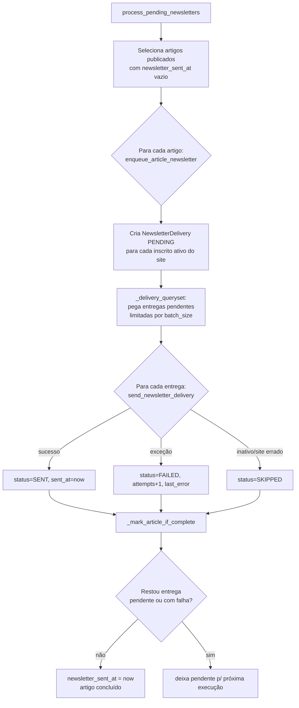

# Fluxo da Newsletter — news_portal

> Como uma newsletter sai, do clique "Publicar" até o e-mail no destinatário. Sistema de **fila com auditoria por destinatário**.
>
> Documentos relacionados: [ARQUITETURA_E_MODELOS.md](ARQUITETURA_E_MODELOS.md) · [SEGURANCA.md](SEGURANCA.md)

---

## ⚠️ Correção de modelo mental

Documentação antiga (e o instinto natural) descreve a newsletter como **envio síncrono dentro do signal de publicação**. **O código atual NÃO funciona assim.**

| Modelo antigo (incorreto hoje) | Modelo real (código atual) |
|--------------------------------|----------------------------|
| Publicar artigo → signal envia e-mails na hora | Publicar artigo → signal apenas **marca como pendente** (loga) |
| Envio bloqueia a request do admin | Envio acontece **depois**, via comando/ação, em **lote** |
| Sem rastro por destinatário | Cada destinatário vira um registro `NewsletterDelivery` (enviado/falhou/pendente) |

Pense em **duas etapas independentes**: (1) *enfileirar* e (2) *processar a fila*.

---

## 1. As peças envolvidas

| Peça | Arquivo | Papel |
|------|---------|-------|
| `Article.newsletter_sent_at` | `apps/news/models.py` | "Carimbo" — vazio = ainda há trabalho; preenchido = concluído |
| `NewsletterSubscription` | `apps/news/models.py` | Inscrito ativo de um site |
| `NewsletterDelivery` | `apps/news/models.py` | Uma linha por (artigo × inscrito): status, tentativas, erro |
| Signal `post_save` | `apps/news/signals.py` | Detecta publicação e **só registra** "pendente" |
| Funções de fila | `apps/news/newsletter.py` | Enfileiram e processam as entregas |
| Comando | `apps/news/management/commands/send_pending_newsletters.py` | Roda o processamento (ideal em cron) |
| Ação do admin | `ArticleAdmin.send_newsletter` | Dispara o processamento manualmente |

### O modelo `NewsletterDelivery`
- `unique_together = [['article', 'subscription']]` → **nunca** duplica entrega para o mesmo par.
- `status`: `pending` / `sent` / `failed` / `skipped`.
- `attempts`, `last_error`, `sent_at` → auditoria e diagnóstico.
- Índices em `(status, created_at)` e `(article, status)` para varrer a fila rápido.

---

## 2. Etapa 1 — Publicar marca como pendente (não envia)

Em [`apps/news/signals.py`](../../apps/news/signals.py):

```python
@receiver(post_save, sender=Article)
def mark_newsletter_pending_on_publish(sender, instance, **kwargs):
    if instance.status != Article.Status.PUBLISHED:
        return
    if instance.newsletter_sent_at is not None:
        return
    logger.info('Newsletter pendente para artigo pk=%s ... Rode send_pending_newsletters para processar.', ...)
```

Ou seja: publicar um artigo **apenas o torna candidato** a newsletter (status `published` + `newsletter_sent_at` vazio). Nenhum e-mail é enviado neste momento. A request do admin volta instantânea.

---

## 3. Etapa 2 — Processar a fila

Toda a lógica está em [`apps/news/newsletter.py`](../../apps/news/newsletter.py). O ponto de entrada é `process_pending_newsletters(...)`, que faz **enfileirar → enviar → concluir**.



### 3.1 Enfileirar — `enqueue_article_newsletter(article)`
- Ignora se o artigo não está publicado, ou se já foi concluído (`newsletter_sent_at` preenchido) — salvo `include_marked_sent=True`.
- Busca inscritos **ativos do site do artigo** (`NewsletterSubscription.filter(site=article.site, is_active=True)`).
- Cria um `NewsletterDelivery` **PENDING** por inscrito, via `get_or_create(article, subscription)` → reexecutar não duplica.
- **Sem inscritos?** Marca o artigo como concluído na hora (não há o que enviar).

### 3.2 Enviar uma entrega — `send_newsletter_delivery(delivery)`
- **Pula** (`skipped`) se o artigo deixou de estar publicado, ou se a inscrição ficou inativa / é de outro site.
- Monta o e-mail (`EmailMultiAlternatives`, versão HTML + texto puro), remetente via `get_from_email`.
- **Sucesso** → `status=SENT`, `sent_at=now`, `attempts+1`, limpa `last_error`.
- **Falha** (qualquer exceção no envio) → `status=FAILED`, `attempts+1`, guarda `last_error` (até 2000 chars). A falha de **um** destinatário **não derruba** os outros.

### 3.3 Concluir — `_mark_article_if_complete(article_id)`
- Só carimba `newsletter_sent_at` quando **não resta** nenhuma entrega `pending` nem `failed` para o artigo.
- Consequência prática: enquanto houver falhas em aberto, o artigo **continua pendente** e pode ser reprocessado.

---

## 4. Como disparar o processamento

### Opção A — Comando (recomendado para automação)
[`send_pending_newsletters`](../../apps/news/management/commands/send_pending_newsletters.py):

```bash
# Processa até 100 entregas pendentes
python manage.py send_pending_newsletters

# Simula sem enviar nem gravar (ótimo para conferir antes)
python manage.py send_pending_newsletters --dry-run

# Reprocessa também as que falharam
python manage.py send_pending_newsletters --retry-failed

# Restringe a um site ou a um artigo
python manage.py send_pending_newsletters --site-id 1
python manage.py send_pending_newsletters --article-id 42

# Lote maior numa execução
python manage.py send_pending_newsletters --batch-size 500
```

| Flag | Efeito |
|------|--------|
| `--batch-size N` | Máximo de entregas processadas nesta execução (padrão 100) |
| `--site-id N` | Apenas artigos de um site |
| `--article-id N` | Apenas um artigo |
| `--retry-failed` | Inclui entregas com falha na tentativa |
| `--dry-run` | Não envia, não grava — só mostra o que faria |

**Operação típica em produção:** agendar o comando em cron (ex.: a cada 5–10 min). Cada execução drena um lote; o `batch_size` evita prender o processo enviando milhares de uma vez.

### Opção B — Ação no admin (envio manual pontual)
Em **Artigos**, selecione os publicados → ação **"Enviar Newsletter para inscritos"**. Internamente chama `process_article_newsletter(article, retry_failed=True, include_marked_sent=True)` para cada um e reporta `enviadas / falhas / ignoradas`. Permite **reenvio manual** mesmo de artigos já marcados como concluídos.

> Há também atalhos no dashboard e no Guia Editorial que levam ao filtro **"Aguardando newsletter"** (`?newsletter=pending`), implementado pelo `NewsletterStatusFilter` no admin.

---

## 5. Cancelamento de inscrição (unsubscribe)

O link de descadastro **não** usa o ID da inscrição (que seria adivinhável). Usa um **token assinado**:

- `make_unsubscribe_token(subscription)` → `signing.dumps({subscription_id, email}, salt=...)`.
- `get_subscription_from_unsubscribe_token(token)` → valida a assinatura; se adulterada, retorna `None`.
- A view `newsletter_unsubscribe` (em `apps/news/views.py`) desativa a inscrição sem exigir login.

Assim ninguém descancela a inscrição de terceiros trocando números na URL.

---

## 6. Remetente e links do e-mail

### Remetente — `get_from_email(site_settings)`
1. Usa `SiteExtension.newsletter_from_email` (+ `newsletter_from_name`, se houver).
2. Se não configurado, cai para `DEFAULT_FROM_EMAIL`.

Configure em **Admin → Configurações do Site**. Sem isso, o dashboard sinaliza "Configuração incompleta" no card *Saúde do sistema*.

### Links — `get_newsletter_context(...)`
- **Envio real:** `base_url = https?://{site.domain}` → depende do **domínio correto no admin → Sites**. Se o domínio estiver errado (ex.: `example.com`), os links do e-mail quebram.
- **Preview (staff):** `base_url` vem de `request.get_host()`, então os links são navegáveis no navegador. Preview em `/news/newsletter/preview/<id>/` (somente staff).

---

## 7. Garantias e armadilhas

| Garantia | Como é obtida |
|----------|---------------|
| Não envia duas vezes ao mesmo inscrito | `unique_together(article, subscription)` + `get_or_create` |
| Falha de um não afeta os outros | `try/except` por entrega em `send_newsletter_delivery` |
| Artigo só "fecha" quando tudo saiu | `_mark_article_if_complete` exige zero entregas abertas |
| Inscrito de outro site não recebe | Checagem `subscription.site_id == article.site_id` |
| Inscrito que cancelou não recebe | Entrega vira `skipped` se `is_active=False` |

**Armadilhas conhecidas:**
- Publicar **não** envia sozinho — é preciso rodar o comando ou a ação. (Por design.)
- Sem servidor SMTP configurado, as entregas viram `failed` — confira *Saúde do sistema* no dashboard.
- `send_article_newsletter(article)` ainda existe como **wrapper de compatibilidade** (retorna a contagem de enviados), mas o caminho atual é a fila.

---

## 8. Diagnóstico rápido

| Sintoma | Onde olhar |
|---------|------------|
| "Publiquei e ninguém recebeu" | Esperado — rode `send_pending_newsletters` (ou a ação do admin) |
| "Entregas com falha" | Admin → **Entregas de Newsletter** → filtro *Falhas* → leia `last_error` |
| "Links do e-mail quebrados" | Admin → **Sites** → corrija o `domain` |
| "Remetente errado/genérico" | Admin → **Configurações do Site** → `newsletter_from_email` |
| "Quero ver sem enviar" | `--dry-run` ou o **Preview** do artigo |
| "Artigo continua 'pendente'" | Há entrega `pending`/`failed` em aberto; reprocesse com `--retry-failed` |

---

_Última atualização: 2026-06-03 — gerado a partir de leitura direta do código (`apps/news/newsletter.py`, `signals.py`, `admin.py`, comando `send_pending_newsletters`)._
