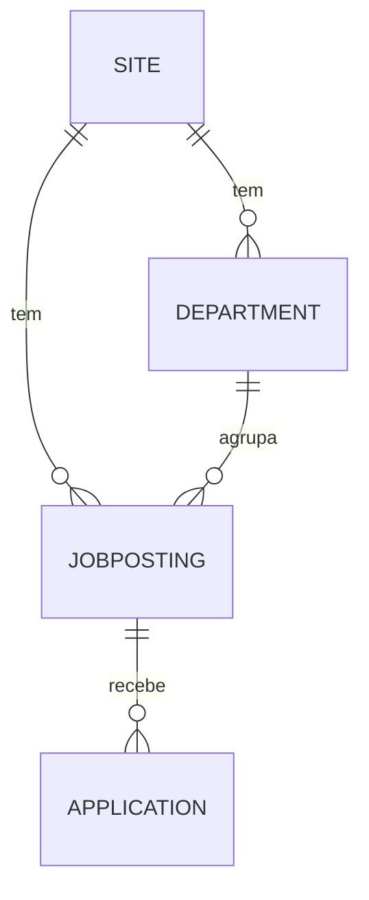
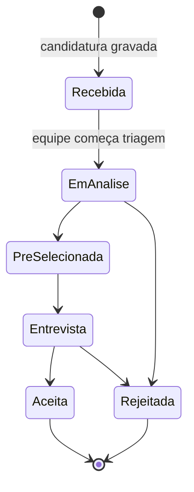
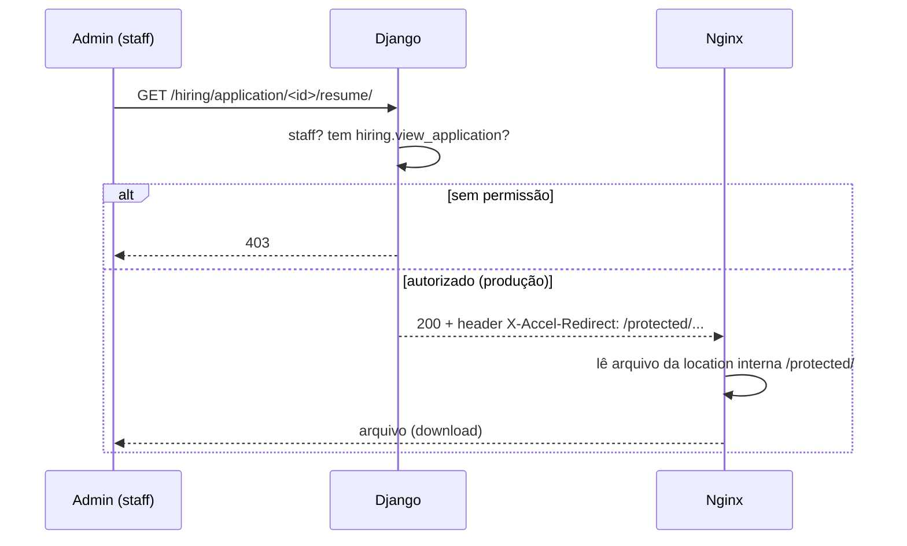

# App `hiring` — Vagas e Candidaturas

> Como funcionam departamentos, vagas e candidaturas no admin, e o download protegido de currículos. As vagas saíram do site público em 14/09/2026.
>
> Documentos relacionados: [ARQUITETURA_E_MODELOS.md](ARQUITETURA_E_MODELOS.md) · [SEGURANCA.md](SEGURANCA.md) · [Troca do site da Komuniki](komuniki-troca-do-site.md)

---

## 1. Visão geral

O app `hiring` era o "Trabalhe conosco" da escola. **Desde 14/09/2026 as vagas não aparecem no site.** A lista, o detalhe e o formulário de candidatura saíram junto com o site antigo da escola. Modelos, dados e admin continuam, em **Recursos guardados**, visíveis só para superusuários. O prefixo `/hiring/` segue montado em [`config/urls.py`](../../config/urls.py) por causa de uma única rota: o download protegido de currículos, usado pelo admin.



| Modelo | Isolado por site? | Papel |
|--------|:-----------------:|-------|
| `Department` | ✅ `ForeignKey(Site)` + `on_site` | Áreas (Pedagógico, Administrativo, …) |
| `JobPosting` | ✅ `ForeignKey(Site)` + `on_site` | A vaga, como registro interno |
| `Application` | herda da vaga | Candidatura (dados do candidato + currículo) |

> **Correção importante:** documentação antiga afirmava que vagas eram "globais, sem `Site`". **Não é verdade no código atual** — `Department` e `JobPosting` têm `ForeignKey(Site)` e `on_site` (migration `0006_site_isolation`). `Application` não tem `Site` próprio porque o site é determinado pela vaga.

---

## 2. Modelos em detalhe

### `Department` — `apps/hiring/models.py`
- `site`, `name`, `slug`.
- `constraints`: `UniqueConstraint(['site', 'slug'])` — slug único **por site**.
- Managers: `objects` + `on_site`.

### `JobPosting`
Herda `TimeStampedModel` + `SEOModel`. Os campos de SEO continuam no modelo, mas o admin deixou de mostrá-los em 14/09/2026, porque a vaga não tem mais página.

| Campo | Observação |
|-------|------------|
| `site`, `department` | A vaga pertence a um site e a um departamento |
| `title`, `slug` | Slug único por site (`unique_job_posting_slug_per_site`) |
| `description`, `requirements` | Conteúdo da vaga |
| `employment_type` | `full_time` / `part_time` / `contract` / `internship` |
| `status` | `draft` / `open` / `closed` — situação interna; nenhum status publica a vaga (texto de ajuda da migração `0008`) |
| `published_at` | Carimbado pela ação em lote que abre vagas no admin |
| `deadline` | Prazo final para candidaturas |

**Validação de integridade multi-site** — `JobPosting.clean()`:

```python
if self.department.site_id != self.site_id:
    raise ValidationError({'department': 'O departamento deve pertencer ao mesmo site da vaga.'})
```

Isso impede associar uma vaga do site A a um departamento do site B.

### `Application`
Herda `TimeStampedModel`.

| Campo | Observação |
|-------|------------|
| `job` | FK para a vaga (define o site implicitamente) |
| `first_name`, `last_name`, `email`, `phone` | Dados do candidato |
| `cover_letter` | Carta de apresentação (opcional) |
| `resume` | Arquivo — **nome gerado via UUID** (ver seção 5) |
| `status` | Pipeline de triagem (ver seção 3) |
| `notes` | Notas internas, **não visíveis ao candidato** |

---

## 3. Ciclo de vida de uma candidatura



Sem o formulário público, nenhuma candidatura nova chega pelo site. As candidaturas já gravadas continuam no admin com o mesmo fluxo.

Os status (`Application.Status`): `received → reviewing → shortlisted → interview → rejected/accepted`.

No admin ([`apps/hiring/admin.py`](../../apps/hiring/admin.py)), as transições mais comuns têm **ações em lote**: "Marcar como Em Análise", "Marcar como Aceito", "Marcar como Rejeitado". Filtros rápidos levam direto a Recebidas / Em análise / Entrevista.

---

## 4. Site público: removido em 14/09/2026

Saíram do código:

| Item | Onde ficava |
|------|-------------|
| Lista de vagas abertas (`job_list`, `/hiring/`) | `apps/hiring/views.py`, `templates/hiring/job_list.html` |
| Detalhe e candidatura (`job_detail`, `/hiring/<slug>/`) | `apps/hiring/views.py`, `templates/hiring/job_detail.html` |
| Formulário `ApplicationForm`, com a validação do currículo | `apps/hiring/forms.py` |
| Base visual do site antigo, usada só por essas páginas | `templates/base_school.html`, com `navbar_school` e `footer_school` |

Hoje `/hiring/` e `/hiring/<slug>/` respondem 404 (`test_job_pages_are_no_longer_public`).

Para trazer as vagas de volta, recupere esses arquivos do commit `02027f0` e refaça os templates sobre `base_school_editorial.html`. O formulário precisa voltar com a validação por magic bytes (seção 5) e com a regra anti-enumeração: uma candidatura duplicada, com o mesmo e-mail na mesma vaga, não era gravada, mas recebia a mesma mensagem de sucesso.

---

## 5. Currículos: o ponto mais sensível

Currículos são dados pessoais (LGPD) e não podem vazar por URL adivinhável. Os já gravados continuam protegidos por duas camadas. A validação do upload saiu com o formulário.

### Camada 1 — Nome de arquivo imprevisível
[`resume_upload_path`](../../apps/hiring/models.py) gera o nome com UUID:
```python
def resume_upload_path(instance, filename):
    return f'hiring/resumes/{uuid.uuid4().hex}{Path(filename).suffix.lower()}'
```
Assim o caminho não deriva do nome do candidato — ninguém adivinha `joao-silva.pdf`.

### Validação de upload — saiu com o formulário
`ApplicationForm.clean_resume` fazia três checagens em sequência:

1. **Tipo MIME declarado** ∈ `{pdf, msword, docx}`.
2. **Extensão** ∈ `{.pdf, .doc, .docx}`.
3. **Assinatura real do arquivo (magic bytes)** — `%PDF-` para PDF, `PK\x03\x04` para `.docx` (um zip) e `\xd0\xcf\x11\xe0` para `.doc` (OLE2).

A checagem 3 era a que importava: MIME e extensão são **falsificáveis** pelo cliente; os magic bytes não. Limite de tamanho: **5 MB**. Sem formulário público, não há upload de currículo pelo site.

### Camada 2 — Download protegido (nunca direto de `/media/`)
A view [`download_resume`](../../apps/hiring/views.py) é a **única** porta para baixar um currículo:

```python
@staff_member_required
@permission_required('hiring.view_application', raise_exception=True)
def download_resume(request, application_id):
    ...
    if settings.DEBUG:
        return FileResponse(...)           # dev: serve direto
    response['X-Accel-Redirect'] = f'/protected/{application.resume.name}'  # prod: nginx serve
    return response
```

- **Exige** estar logado como staff **e** ter a permissão `hiring.view_application`.
- **Em produção** usa `X-Accel-Redirect`: o Django autoriza, mas quem entrega o arquivo é o nginx, a partir de uma *location interna* (`/protected/`). O Django não fica segurando bytes de arquivo.
- **Em desenvolvimento** (sem nginx) cai para `FileResponse`.

No [`nginx.conf`](../../docker/nginx/nginx.conf), o acesso público direto é **bloqueado**:
```nginx
location /protected/            { internal; alias /app/media/; }   # só acessível via X-Accel
location /media/hiring/resumes/ { internal; }                      # bloqueia acesso direto
location /media/                { alias /app/media/; expires 7d; } # resto da mídia é público
```

### Sequência completa do download



No admin, o link "Baixar currículo" (`resume_link` em `ApplicationAdmin`) aponta para essa view — nunca para `/media/` diretamente.

---

## 6. URLs do app

[`apps/hiring/urls.py`](../../apps/hiring/urls.py):

| Rota | View | Acesso |
|------|------|--------|
| `/hiring/application/<id>/resume/` | `download_resume` | Staff + permissão |

`/hiring/` e `/hiring/<slug>/` respondem 404 desde 14/09/2026.

---

## 7. Checklist mental ao mexer no hiring

- [ ] Erro ao salvar vaga? Pode ser `clean()` — departamento de outro site.
- [ ] Currículo não baixa em produção? Verifique a location `/protected/` no nginx e o header `X-Accel-Redirect`.
- [ ] Pediram as vagas de volta no site? Siga a seção 4: views, formulário com validação por magic bytes e templates sobre a base editorial.

---

_Última atualização: 2026-09-14 — vagas fora do site público._
