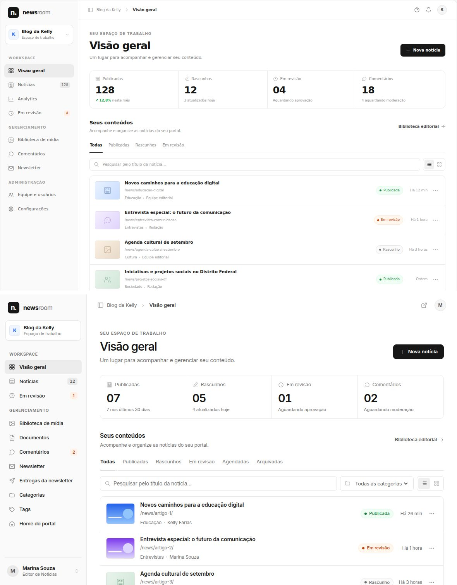
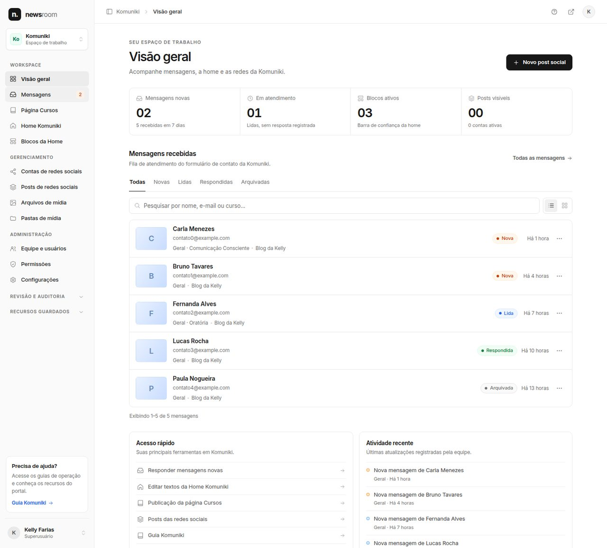
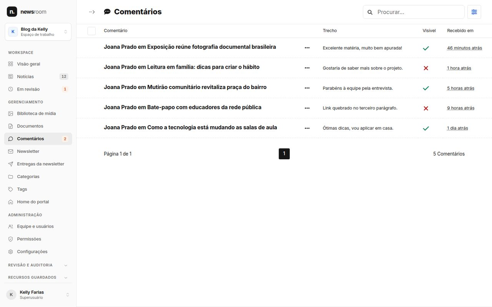
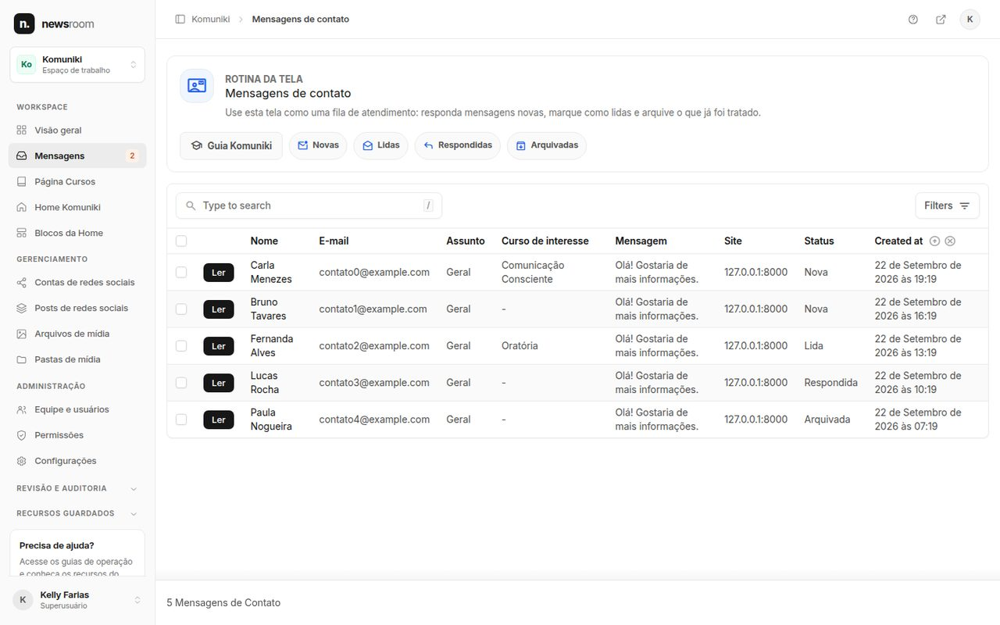
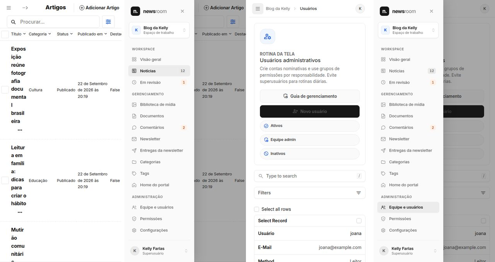
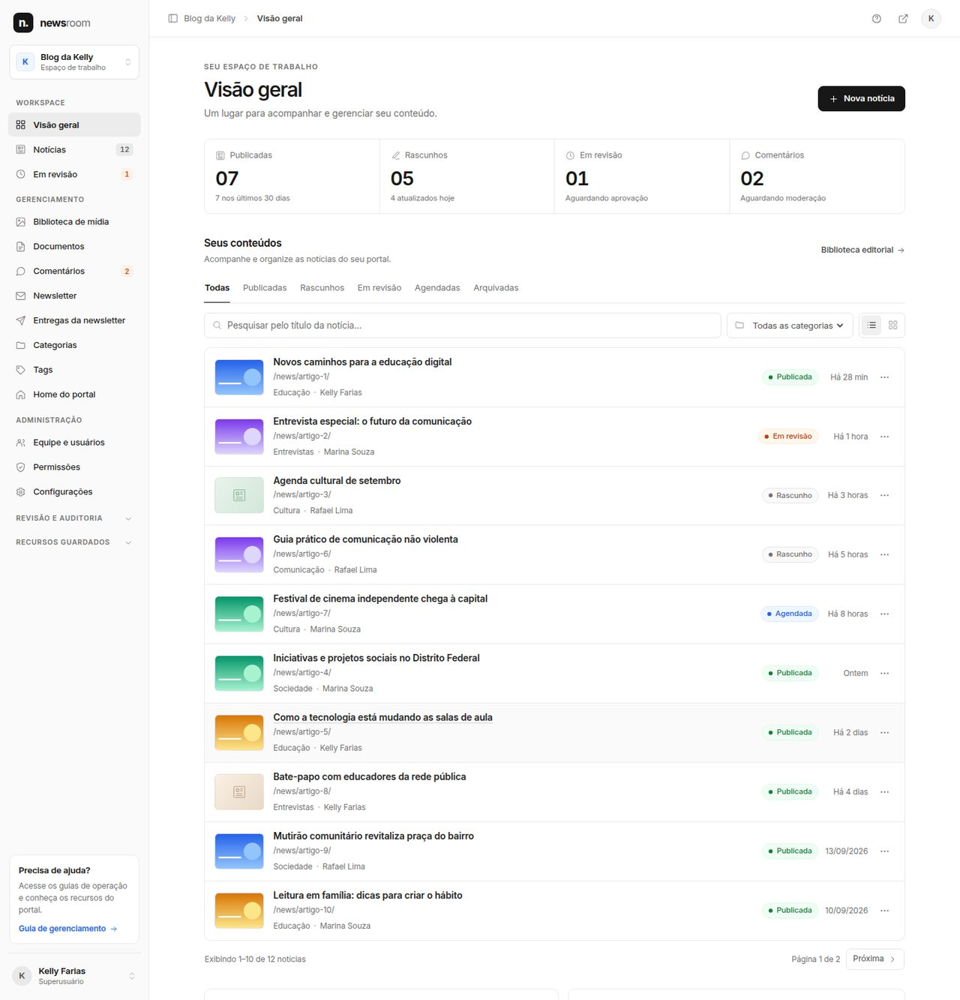

# Painel administrativo unificado ("Newsroom")

O Django admin (Unfold) e o Wagtail passaram a funcionar como **um único painel**: a mesma sidebar, a mesma topbar, a mesma paleta e a mesma tipografia nas três superfícies administrativas, com uma visão geral central em `/painel/`.

Contrato visual: a prévia aprovada `newsroom_dashboard_referencia.html`, inspirada na dashboard da Dub (https://dub.co/). As medidas foram escaladas cerca de 1,17× para uso real (a prévia foi desenhada num quadro compacto, com texto-base de 12px), preservando proporções, cores, raios e composição.



---

## 1. Arquitetura em uma frase

**A porta continua em `apps/accounts/panels.py`; a mobília mora em `apps/common/newsroom/`.** Quem pode entrar em qual área não mudou. O que mudou é o que a pessoa vê depois de entrar: uma casca única, renderizada no servidor, usada por:

| Superfície | Como recebe a casca |
|---|---|
| Visão geral `/painel/` | `templates/newsroom/base.html` (FBV `apps.common.newsroom.views.dashboard`) |
| Wagtail `/cms/...` | `templates/wagtailadmin/base.html` estende o `base.html` do Wagtail (mecanismo documentado) e troca **só** a sidebar React pela sidebar do painel |
| Django admin `/admin/...` | `templates/admin/nav_sidebar.html` e `templates/unfold/helpers/header.html` trocam a sidebar e o cabeçalho do Unfold |

As três usam as mesmas inclusion tags (`apps/common/templatetags/newsroom.py`): ``, `` / `` e ``.

### Módulos

| Arquivo | Responsabilidade |
|---|---|
| `apps/common/newsroom/branding.py` | Identidade configurável (`settings.NEWSROOM`): nome, marca e rótulos dos espaços de trabalho |
| `apps/common/newsroom/workspaces.py` | Espaços de trabalho (Blog da Kelly, Komuniki) e chave de sessão |
| `apps/common/newsroom/navigation.py` | **Registro único da navegação** e das regras de visibilidade |
| `apps/common/newsroom/dashboard.py` | Consultas da visão geral (indicadores, listagem, atividade, atalhos) |
| `apps/common/newsroom/views.py` | FBVs: visão geral, troca de espaço e os redirecionamentos de `/cms/` e `/admin/` |
| `apps/news/editorial.py` | Regras editoriais compartilhadas (contagens, estado de cada notícia, filtros). Antes viviam só no dashboard do Wagtail |
| `apps/news/wagtail_moderation.py` | Comentários e newsletter no Wagtail (ver §6) |
| `apps/news/permissions.py` | Regra editorial por notícia: quem altera qual notícia, e equipe que pode assinar (ver §9) |
| `apps/news/wagtail_article.py` | Formulário, painéis e views do editor de notícias que aplicam essa regra (ver §9) |
| `apps/common/dashboard.py` | Saúde do envio de e-mails/newsletter e guias de operação (antes era o `DASHBOARD_CALLBACK`) |
| `apps/common/newsroom/editor.py` | Dados da barra única do editor: voltar, título, status lido do banco e menu "Mais opções" (ver §8) |

### Identidade configurável

```python
# config/settings/*.py — tudo opcional; ausente = padrão de branding.py
NEWSROOM = {
    'BRANDING': {'NAME': 'news', 'NAME_SUFFIX': 'room', 'MARK': 'n.', 'PRODUCT_NAME': 'Newsroom'},
    'WORKSPACES': {'komuniki': {'label': 'Komuniki', 'initial': 'Ko', 'tone': 'green'}},
}
```

---

## 2. Rotas

| Rota | Nome | Comportamento |
|---|---|---|
| `/painel/` | `panel:dashboard` (e `panel:picker`, mantido como alias) | Visão geral. Porta: `panels.available_panels(user)` não vazio; sem área → `panel:no_access` |
| `/painel/espaco/` | `panel:workspace` | `POST` com CSRF. Só aceita espaços que a pessoa enxerga |
| `/cms/` | `wagtailadmin_home` (inalterado) | Redireciona para `/painel/` **atrás de `require_admin_access`** — quem não alcança o Wagtail recebe a mesma resposta de antes |
| `/admin/` | `admin:index` (inalterado) | Redireciona para `/painel/` **atrás de `admin.site.admin_view`** — mesma porta de antes |

- **Destino pós-login** (`panels.post_login_target`): `next` seguro > painel escolhido no formulário (se permitido) > **visão geral para quem alcança ao menos uma área** > portal público. Antes, quem tinha uma área só entrava direto nela, e quem tinha duas via a tela de escolha. Essa tela (`panel_picker` + `templates/auth/panel_picker.html`) foi removida: a escolha virou a própria navegação.
- Nenhum nome de rota existente foi removido nem mudou de endereço.

---

## 3. Espaços de trabalho

Os dois portais compartilham o mesmo `Site` (`SITE_ID = 1`) e se separam por app. O espaço de trabalho é, portanto, um **recorte** da navegação, dos indicadores, da listagem e da atividade:

- **Blog da Kelly:** notícias, revisão, mídia do Wagtail, comentários, newsletter, categorias, tags e home do portal.
- **Komuniki:** mensagens de contato, página Cursos, home e blocos da Komuniki, redes sociais e biblioteca de arquivos legada.
- **Administração** (usuários, permissões, configurações) aparece nos dois.

O seletor também traz **“Ver <espaço> no ar”**, que abre o portal público (`KELLY_BLOG_PUBLIC_URL` / `KOMUNIKI_PUBLIC_URL`) e substitui o antigo grupo “Visualizar Portais” do Unfold e o “Ver portal” do dashboard do Wagtail. Um espaço só é oferecido a quem enxerga alguma ferramenta dele. A escolha fica na sessão, mas **a tela aberta vence**: abrir `/admin/contact/...` mostra a navegação da Komuniki mesmo com o Blog escolhido. Espaço de trabalho não é autorização. Cada tela continua checando a própria permissão.



---

## 4. Navegação: uma fonte de verdade

Cada item de `navigation.NAV_ITEMS` delega a visibilidade à **mesma checagem que a tela de destino aplica**:

| Destino | Regra de visibilidade |
|---|---|
| Tela do Django admin | `panels.can_access_admin` (porta do `/admin/`) + `ModelAdmin.has_view_or_change_permission` (checagem do changelist) |
| Snippet do Wagtail | `panels.can_access_cms` (porta do `/cms/`) + `viewset.permission_policy.user_has_any_permission(add/change/delete/view)` (a regra do IndexView) |
| Imagens e documentos | `panels.can_access_cms` + `permission_policy` do Wagtail (a regra do `ImagesMenuItem`/`DocumentsMenuItem`, incluindo coleções) |
| "Revisão e auditoria" | Itens do `reports_menu`/`settings_menu` do próprio Wagtail, filtrados pelo `is_shown` deles |
| "Recursos guardados" | Superusuário + checagem do `ModelAdmin`, como era no menu do Unfold |

Assim o menu nunca promete uma tela que a tela recusa. E esconder um item não protege nada: as views continuam checando no backend (há testes para isso).

- `UNFOLD['SIDEBAR']['navigation']` ficou vazio: um segundo menu seria uma segunda fonte de verdade.
- Selos: total de notícias (neutro), e em revisão, comentários pendentes e mensagens novas (alerta, só com contagem > 0). Uma consulta `COUNT` por selo, e só para quem vê o item.
- "Bloqueios de acesso", "Histórico de acessos" e "Falhas de login" (django-axes) entram em Administração com a checagem do `ModelAdmin`. Como nenhum cargo recebe permissões do app `axes`, na prática só o superusuário os vê. Desbloquear alguém é apagar a tentativa em "Bloqueios de acesso". "Redirecionamentos" vem do `settings_menu` do Wagtail (ver §9).
- Ocultos do menu, mas acessíveis por URL a quem tem permissão: relatórios e sites de **páginas** do Wagtail (o projeto não usa a árvore de páginas) e a tela de **Usuários do Wagtail**. Esta última porque editar conta por ela pularia a sincronização cargo → grupo feita em `apps/accounts/admin.py::save_related`.

---

## 5. Visão geral

A composição segue a referência: cabeçalho e ação principal, indicadores num contêiner dividido, seção central, ferramentas de busca e filtro, listagem, acesso rápido e atividade recente.

| Bloco | Fonte real |
|---|---|
| Publicadas / Rascunhos / Em revisão | `apps.news.editorial.article_status_counts()` (a mesma contagem do antigo dashboard "Redação") |
| Notas dos indicadores | `published_at` nos últimos 30 dias, `updated_at` de hoje, `WorkflowState` ativo, `Comment.is_active=False` |
| Mensagens novas / Em atendimento (Komuniki) | `ContactInquiry.status` |
| Blocos ativos / Posts visíveis (Komuniki) | `SchoolFeature` (posição de confiança), `SocialPost.is_visible`, `SocialAccount.is_active` |
| Atividade (Blog) | `wagtail.models.ModelLogEntry` das notícias + comentários recebidos |
| Atividade (Komuniki) | `django.contrib.admin.models.LogEntry` dos modelos que a pessoa pode ver + mensagens recebidas |
| Saúde do envio | `apps.common.dashboard.build_system_health` (detalhes técnicos só para superusuário) |

**Nenhum número é inventado.** O "↗ 12,8%" da prévia não tem fonte no sistema e não foi reproduzido. "Analytics" e o sino de notificações também ficaram de fora, porque não existe funcionalidade real correspondente (ver §12).

### Listagem

- Paginação, busca (título; na Komuniki, nome, e-mail ou curso), abas de estado e categoria são feitas **no servidor** (`Paginator`, 10 por página). Há teste garantindo que o número de consultas não cresce com a quantidade de linhas.
- HTMX (já vendorizado em `static/js/vendor/htmx.min.js`): a busca, as abas e a paginação trocam só a região de resultados (`#nr-results`) e as abas (`hx-select-oob`). O campo de busca nunca é substituído, então foco e texto digitado não se perdem. Sem JavaScript, tudo funciona como formulário GET comum.
- Lista e grade usam os mesmos dados. A preferência fica na URL (`?view=grid`) e no `localStorage`.
- Estado de cada linha: Em revisão > Agendada > Publicada / Arquivada / Rascunho. "Alterações não publicadas" aparece quando a versão no ar tem revisão mais nova.
- A miniatura reaproveita `Article.card_image_url` (rendition `fill-600x400` já gerada para o portal) com as renditions pré-carregadas. Sem imagem, aparece um placeholder na paleta, com tom por categoria.

### Ações: sempre as nativas

Criar, editar, revisar, despublicar, histórico e excluir são **links para as views oficiais** do `ArticleSnippetViewSet` (`wagtailsnippets_news_article:add/edit/history/unpublish/delete`). Publicar e aprovar/rejeitar revisões acontecem no editor do Wagtail (menu de ações e fluxo de trabalho). A visão geral nunca altera `status`, `live` ou revisões. Cada ação só aparece para quem tem a permissão correspondente, e a view de destino confere de novo. "Editar" segue a regra **por notícia** (§9): quando a pessoa não pode alterar aquela notícia, a linha oferece "Ver" (ficha somente leitura do Wagtail).

---

## 6. Migração progressiva para o Wagtail

**Comentários, assinantes e entregas da newsletter** ganharam telas no Wagtail (`SnippetViewSet` em `apps/news/wagtail_moderation.py`).

Motivo concreto: o cargo *Editor de Notícias* recebe as permissões `news.*_comment` e `news.*_newsletter*` (`admin_roles.py`), mas **não é `is_staff`**, então nunca alcançou essas telas, que só existiam no `/admin/`. No Wagtail elas ficam atrás da porta que o editor já usa (`access_admin`) e das mesmas permissões de modelo. Nenhuma permissão nova foi concedida.

Paridade com o Django admin:

| Recurso | Django admin | Wagtail |
|---|---|---|
| Criar registro à mão | Não | Não (política sem `add`, inclusive para superusuário) |
| Texto do comentário / dados da inscrição | Somente leitura | Somente leitura (`FieldPanel(read_only=True)`) |
| Aprovar/ocultar comentários em lote | Action | Ação em massa "Aprovar"/"Ocultar" |
| Reativar/desativar inscrições em lote | Action | Ação em massa "Reativar"/"Desativar" |
| Entregas da newsletter | Somente leitura | Somente leitura (inspeção; política sem `add`/`change`) |
| Exportar e-mails em CSV | Superusuário, com neutralização de fórmulas (`_csv_safe`) | **Não habilitado**: a exportação nativa do Wagtail não neutraliza fórmulas |

As telas do Django admin **continuam registradas** (nada foi removido). Na navegação, a exportação aparece em "Recursos guardados › Exportar assinantes (CSV)".



---

## 7. O que permanece no Django admin (exceções documentadas)

Continuam no Unfold, **dentro da mesma casca**, porque a migração traria risco sem ganho funcional:

| Tela | Por que fica |
|---|---|
| Usuários (`CustomUserAdmin`) | Formulário do `UserAdmin` (senha, `usable_password`) + sincronização cargo → grupo em `save_related` |
| Grupos e permissões | Editor de permissões do `GroupAdmin` |
| Komuniki: página Cursos, Home, Blocos, Depoimentos | Formulários com campos bilíngues, fieldsets condicionais por superusuário e querysets restritos (`PageAdmin.get_queryset`, `get_fieldsets`) |
| Mensagens de contato | Fila de atendimento com ações e campos somente leitura; o cargo que a usa (Admin Komuniki) já é `is_staff` |
| Redes sociais | `SocialAccountAdminForm` trata tokens como senha (nunca reexibe; em branco mantém o atual) |
| Biblioteca de mídia legada (`media_library`) | Otimização de imagem no upload (`_optimize_image_field`) |
| Vagas, candidaturas, curtidas, favoritos, códigos de verificação, identidades Google | Recursos guardados / trilhas de auditoria, só superusuário |
| Guias de operação (`/admin/guias/...`) | Páginas-tutorial do admin |

O Unfold **não foi removido**: seus formulários, filtros, ações e abas continuam em uso. Ele recebeu a paleta do painel (`UNFOLD['COLORS']`, tema claro) e a casca comum.



---

## 8. Tema, design system e acessibilidade

- **Tokens:** `static/newsroom/css/newsroom.css` (prefixo `nr-`) é a fonte única de cor, raio, medida e fonte (Inter variável local, `static/fonts/editorial/`, sem CDN). Ícones: sprite local `static/newsroom/icons.svg`.
- **Wagtail:** `static/newsroom/css/newsroom-wagtail.css`, via hook oficial `insert_global_admin_css`, mapeia os tokens `--w-color-*` (mecanismo documentado de marca do Wagtail) para a paleta. Só o raio de botões e campos é ajustado. Seletores de mídia, painéis de publicação e fluxos de revisão continuam com o CSS nativo. No editor de blocos, a única mudança é o arrastar para reordenar (abaixo).
- **Arrastar blocos (StreamField):** o Wagtail 7.4 já cria um SortableJS em cada lista de blocos, mas só com a alça ⠿ como pega. `static/newsroom/js/newsroom-streamfield.js`, carregado pelo hook `insert_editor_js` (só formulários de criação e edição), ajusta essa mesma instância, sem biblioteca nova:
  - **Pega:** com mouse, o bloco é arrastado pela barra de título inteira. Os demais botões do cabeçalho continuam só clicáveis e um clique simples ainda recolhe ou abre o bloco. Com dedo ou caneta, só pela alça, que recebe `touch-action: none`. Sem isso o celular trata o gesto como rolagem e cancela o arraste. O resto do cabeçalho continua rolando a página.
  - **Ordem gravada:** corrige um defeito do próprio Wagtail 7.4.2. Os blocos excluídos ficam na página, ocultos, até salvar, e os índices do SortableJS os contam. Depois de excluir um bloco, arrastar outro gravava uma ordem diferente da que aparecia na tela. Agora os índices vêm da lista de blocos vivos, e o que se vê é o que se salva.
  - **Durante o arraste:** o destino aparece com contorno azul tracejado. No celular, uma cópia do bloco, com altura limitada, acompanha o dedo. O conteúdo dos blocos (texto rico, tabela, campos) não recebe o ponteiro, então nada cai dentro de um editor. A faixa de rolagem automática vai até 40px abaixo da barra fixa do editor. Com os 30px padrão do SortableJS ela ficava inteira atrás da barra, que tem 64px no computador e ~106px no celular, e subir a página exigia arrastar por cima dela. A velocidade é a padrão, porque uma maior exagerava um tropeço do SortableJS: a rolagem continua um pouco depois de o dedo sair da borda. `prefers-reduced-motion` desliga a animação.
  - Vale para todo StreamField editado no Wagtail: corpo da notícia e destaques da home. Os botões ↑/↓ continuam sendo o caminho pelo teclado.
- **Barra única do editor:** nos formulários de criação e edição de snippets (notícias, categorias, tags, destaques da home…), o cabeçalho do Wagtail e o rodapé de salvar/publicar viram uma barra só, no topo. `templates/wagtailsnippets/snippets/edit.html` e `create.html` trocam só o bloco `slim_header` por `templates/newsroom/editor/header.html`.
  - **Esquerda:** voltar (‹), trilha "Notícias › título", selo de status (Rascunho, Publicada, Em revisão, Agendada, Arquivada, com a mesma regra da visão geral, `apps/news/editorial.py`), observação ("Alterações não publicadas", "Etapa: Aprovação Editorial", "Publica em 25/09 às 10:00", "Nova versão agendada para …", "Data marcada para …, ainda não agendada"), salvamento automático ("✓ Salvo") e quem mais está editando. O status é lido da linha no banco, nunca da revisão que a view entrega. Clicar no selo abre o painel "Status".
  - **"Agendada" é agendamento de verdade:** existe uma revisão com `approved_go_live_at`, a que o "Agendar publicação" cria e o `publish_scheduled` publica. Só preencher a data em "Definir cronograma" e salvar o rascunho não agenda nada. Antes, a regra (`editorial.scheduled_q`/`editorial_state`, também usada pela aba "Agendadas" e pela contagem da visão geral) olhava só `go_live_at` e chamava de "Agendada" um rascunho que nunca iria ao ar sozinho. Agora esse caso fica "Rascunho", com a observação "ainda não agendada".
  - **Direita:** ferramentas (Status, Pré-visualizar, Verificações, Histórico), só ícones abaixo de 1440px e com rótulo acima disso. Depois vêm as ações: o botão preto é o passo que leva a matéria adiante (aprovar, publicar ou enviar para moderação, nessa ordem de preferência), "Salvar rascunho" fica ao lado e o resto (retirar do ar, cancelar moderação…) vai no menu da seta, com as destrutivas por último. Fechando a barra, o menu ⋯ tem Copiar, Inspecionar e Remover (vermelho, separado).
  - **Por que os botões não saem do formulário:** o Wagtail só aplica a proteção de edição simultânea (aviso de que outra pessoa salvou uma versão mais nova) aos botões dentro de `[data-edit-form]`. O rodapé nativo continua na página, oculto, e `static/newsroom/js/newsroom-editor.js` cria na barra botões que clicam nos nativos. Spinner, "Publicando…", modais de moderação e Ctrl+S continuam sendo do Wagtail, e a barra espelha o estado. Se o script falhar, o rodapé nativo reaparece.
  - **Salvamento automático:** depois de cada salvamento, o Wagtail reenvia pedaços da tela; `templates/wagtailadmin/generic/edit_partials.html` acrescenta o título, o status e o menu ⋯ da barra. Assim "Alterações não publicadas" aparece sem recarregar, e na criação o menu surge quando a notícia passa a existir.
  - **Celular:** duas linhas. Na primeira ficam voltar, título e status; na segunda, as ferramentas e as ações. "Salvar rascunho" vai para o menu da seta, e o botão principal usa rótulo curto ("Publicar", "Enviar"), com o nome completo no `title` e no `aria-label`.
  - **Também sobrescritos (cópias fiéis, com a diferença comentada):** `wagtailadmin/shared/side_panel_toggle.html` (ícones do painel e rótulo visível), `wagtailadmin/shared/autosave/indicator.html` e `unsaved_changes_warning.html`. Esses dois últimos só traduzem "Saved" e "Autosave is paused", que ainda não têm tradução pt-BR no Wagtail 7.4.
- **Unfold:** `UNFOLD['COLORS']` (cinzas neutros; "primária" em `#171717`, botões pretos como na referência), `THEME='light'` e `static/newsroom/css/newsroom-unfold.css`. Os tokens do design system `kb-` (guias e ajudas contextuais) foram convertidos do tema escuro para a paleta clara.
- **Tema único (claro):** a referência é clara, e o projeto já forçava um tema só (o Unfold era forçado no escuro). No Wagtail, o bloco de tokens vale também para `.w-theme-dark`/`.w-theme-system`. Sem isso, quem usa o sistema operacional no modo escuro veria o Wagtail escuro e a visão geral clara.
- **Contraste:** o texto mais claro é `#737373` (4,7:1 sobre branco). Os cinzas mais claros da prévia (`#a3a3a3`, `#929292`) ficaram só para ícones e divisórias.
- **Responsivo:** a partir de 1024px, a sidebar é fixa (224px). Abaixo disso, vira gaveta com os mesmos rótulos: botão com `aria-expanded`, fundo escurecido, Esc fecha e o foco volta ao botão. A barra de indicadores passa a 2 × 2 no celular, e as listagens do Wagtail rolam dentro da própria área (sem rolagem horizontal da página).
- **Teclado e leitores de tela:** link "Pular para o conteúdo", `aria-current` no item ativo, rótulos acessíveis em botões só com ícone, menus em `<details>` (acessíveis sem JavaScript), anel de foco azul e `prefers-reduced-motion` respeitado.
- **Isolamento:** nada disso é carregado pelos portais públicos. Os templates e o CSS públicos não foram tocados.



---

## 9. Governança editorial: quem altera o quê

O painel do Wagtail deixava qualquer pessoa com `news.change_article` alterar **qualquer** notícia, inclusive publicadas de colegas, e escolher destaque, portal, autor e agendamento. A regra abaixo foi decidida com a redação e é aplicada no servidor. Esconder botões é só consequência.

| Cargo | Próprias notícias | Notícias de colegas |
|---|---|---|
| Repórter (sem `news.publish_article`) | altera em qualquer estado | altera só enquanto forem **rascunho**; publicadas e retiradas do ar abrem a ficha somente leitura |
| Editor de Notícias, Administrador Geral, superusuário | altera | altera |

- **Fonte única:** `apps/news/permissions.py` (`can_edit_article`, `ArticlePermissionPolicy`). Ela é usada pela política de permissão do snippet (listagem, link do título, botão "Editar", cópia), pelo hook `before_edit_snippet` (edição e restauração de revisão, GET e POST) e pela visão geral. "Rascunho" é o `status` da linha no banco. O hook não confia no objeto que a view entrega, porque é a última revisão e ela guarda o `status` antigo.
- **Recusa:** quem tenta editar sem poder volta para a ficha da notícia (`inspect`), com uma mensagem que explica a regra e sugere copiar como rascunho novo.
- **Em revisão:** o próprio Wagtail continua travando a edição para quem não aprova a etapa (`WorkflowLock`); a regra não afrouxa isso.
- **Aprovação:** a etapa "Aprovação Editorial" passa a aceitar o grupo **Editor de Notícias**, além do Administrador Geral (`apps/news/migrations/0027`). Antes, o editor, que tem permissão de publicar, não conseguia aprovar o que o repórter enviava.
- **Campos sensíveis:** destaque na home (`is_featured`), portal (`site`), autor e agendamento (`go_live_at`/`expire_at`) usam `FieldPanel(permission='news.publish_article')`. O Wagtail **remove esses campos do formulário** de quem não publica: se forem enviados à mão, são ignorados. `RestrictedPublishingPanel` repassa a permissão aos campos do agendamento, porque a permissão de um grupo de painéis só esconde o grupo.
- **Autoria:** notícia nova nasce assinada por quem cria e no portal atual. Quem publica pode trocar o autor, mas a lista só mostra a equipe editorial (contas ativas com permissão de escrever notícias). Antes ela listava todas as contas, inclusive leitores do portal.
- **Copiar:** a cópia é enviada para a view de adição e vira um **rascunho novo**, assinado por quem copia (repórter). O Wagtail 7.4 aceitaria um POST direto no endereço de cópia e o gravaria **sobre a notícia original**, bastando permissão de "ver". Esse POST agora é recusado (405).
- **Endereço (slug) depois de publicar:** pode mudar. Quando o slug de uma notícia que já esteve no ar muda, `apps/news/signals.py` cria um redirecionamento permanente (301) do endereço antigo para o novo (`wagtail.contrib.redirects`). Isso acontece na publicação da revisão, nunca num rascunho. Cadeias são encurtadas (a→b→c vira a→c e b→c), e voltar ao slug antigo remove o redirecionamento que partia dele. O `RedirectMiddleware` só age em respostas 404, então um endereço que existe nunca é desviado. A gestão manual fica em "Redirecionamentos" e, hoje, só o superusuário tem as permissões `wagtailredirects`.
- **Corpo da notícia:** nenhum bloco do StreamField nem recurso do editor de texto foi cortado (decisão da redação).

---

## 10. Segurança e compatibilidade

- Nenhum novo sistema de login, modelo de usuário, backend, grupo ou permissão. Os grupos e as permissões por cargo (`apps/accounts/admin_roles.py`) não mudaram.
- **Migrações (governança, §9):**
  - `news/0027_editor_approves_editorial_workflow` é **só de dados**: acrescenta o grupo "Editor de Notícias" aos aprovadores da tarefa "Aprovação Editorial". É idempotente e não recria a tarefa se ela tiver sido removida. O reverso retira apenas esse grupo.
  - `wagtail.contrib.redirects` traz as migrações do próprio Wagtail, que criam a tabela `wagtailredirects_redirect`. Nenhuma tabela existente é alterada.
- Autenticação ≠ autorização: `/painel/` exige área administrativa. Leitor autenticado vai para "sem acesso". Os redirecionamentos de `/cms/` e `/admin/` estão atrás das portas originais de cada framework.
- Troca de espaço de trabalho: só `POST` com CSRF, só para espaços visíveis, e o redirecionamento é para um destino fixo (sem `next` arbitrário).
- "Sair" envia `POST` para `panel:logout` com `next` fixo em `panel:login`: encerra a sessão das três áreas.
- Parâmetros de listagem validados (`status` numa lista fechada, categoria numérica, busca limitada a 100 caracteres). Tudo é renderizado com escape automático, sem `|safe`.
- Consultas da visão geral sempre filtradas pela mesma regra de visibilidade da navegação. O admin da Komuniki não recebe dados de notícias, nem pela URL.

---

## 11. Testes

- `apps/news/test_governance.py` (43 testes): matriz cargo × dono × estado (rascunho, publicada, retirada) conferida na regra, na política do snippet e na porta da edição; POST de edição recusado sem alterar nada; restauração de revisão; links da listagem; campos sensíveis ausentes e ignorados mesmo se forjados; lista de autores sem leitores; cópia que nunca grava sobre a original; editor aprovando e publicando o envio do repórter; redirecionamentos (301 real, rascunho não gera, cadeias e volta ao slug antigo).
- `apps/common/test_newsroom.py` (46 testes): login e redirecionamento, acesso e recusa, portas de `/cms/` e `/admin/`, navegação por cargo, isolamento entre espaços, busca, filtros e paginação no servidor, número de consultas constante, lista × grade, links de criação/edição, ações por permissão, reflexo de rascunho/revisão/publicação/arquivamento, agendamento, casca nas telas do Wagtail e do admin (e ausência dela em popups), script de arrastar blocos só nos formulários, logout, moderação no Wagtail (inclusive recusas), dados reais nos indicadores, auditoria e rotas preservadas.
- `apps/common/test_editor_bar.py` (15 testes): a barra no lugar do cabeçalho nativo; menu ⋯ com Remover por último; botões de publicação dentro do formulário; status de rascunho, publicada com alterações pendentes, agendada de verdade, data sem agendar, nova versão agendada, em revisão e revisão com `status` antigo; tela de criação; categoria sem status; barra reenviada pelo salvamento automático; "Agendar publicação" e "Ir para o primeiro erro" em português.
- Testes de ponta a ponta (fora do repositório; servidor, banco e Edge headless próprios por bateria, usuários de cada cargo):
  - Arrastar com mouse e com toque (412, 384 e 980px com toque), inclusive depois de excluir e inserir blocos, e os destaques da home.
  - Todos os fluxos da barra por cargo: publicar, retirar do ar, enviar, aprovar, pedir mudanças, cancelar, agendar, travar, erros de validação, copiar, remover, histórico e criação com salvamento automático.
  - Proteção de edição simultânea pelos botões da barra, teclado e acessibilidade, script da barra bloqueado, 150 checagens de layout em 9 larguras, outros cadastros e as telas nativas do Wagtail, do Unfold e do painel.
  - Cada achado foi reproduzido por um verificador independente.
  - Confirmados e corrigidos: a regra de "Agendada", os textos em inglês "Schedule to publish" e "Go to the first error" e o rótulo curto "Publicar" no celular ao agendar.
  - O resto era efeito do próprio teste: rolagem suave medida no meio, clique depois de um arraste sintético, toques espaçados demais.
- Barra do editor no navegador (1600, 903 e 384px):
  - "Salvar rascunho" da barra salvando de verdade.
  - Menus da seta e do ⋯.
  - Painéis de pré-visualização e status abrindo pelos botões e pelo selo, inclusive depois do salvamento automático.
  - Indicador "Salvo".
  - Troca de selo e menu sem erro no console.
  - Botão principal de repórter ("Enviar") simulado sem o botão "Publicar".
  - Categoria só com "Salvar".
  - Sem rolagem horizontal.
- Arrastar blocos: o projeto não tem ferramenta de teste de JavaScript, então foi validado no navegador, no editor de uma notícia de teste.
  - Arraste real pela barra de título e pela alça.
  - Clique simples ainda recolhendo o bloco.
  - Botões do cabeçalho sem iniciar arraste.
  - Toque na barra de título sem iniciar arraste; toque na alça iniciando.
  - Arraste por toque a 384px no modo Android do SortableJS.
  - Ordem gravada pelo salvamento automático igual à da tela.
  - O defeito do Wagtail reproduzido com o código original e ausente com o ajuste.
- Testes existentes atualizados onde o comportamento mudou de propósito (destino pós-login, páginas iniciais antigas, painéis "Redação"). Cada um mantém a garantia original no endereço novo.
- Validação visual com Chromium (Playwright) em 1440, 1280, 834 e 390px, com interação real: busca HTMX, abas, grade, paginação, menus, gaveta e troca de espaço.

---

## 12. Limitações e pendências

- **Cabeçalho do Wagtail:** os formulários de snippet usam a barra única do editor (§8), montada sobre os controles nativos. As demais telas do Wagtail (listagens, imagens, documentos, usuários) mantêm o cabeçalho nativo, com a paleta do painel e sem o espaço de trabalho na trilha.
- **Traduções que faltam no Wagtail 7.4.2 (pt-BR):** "Schedule to publish", "Scheduling…", "Go to the first error", "Saved" e "Autosave is paused" foram fixados em português em templates do projeto. "Once scheduled:", dentro do painel Status, continua em inglês: fica num template grande do Wagtail, que não vale copiar por uma palavra.
- **Avatares do Gravatar no ambiente local:** o Wagtail monta a URL do Gravatar com `http` fora do HTTPS, e a CSP (`img-src 'self' data: https:`) bloqueia. Isso só acontece no desenvolvimento, porque em produção a página é `https`. É anterior a estas mudanças.
- **Barra do editor e salvamento automático:** o selo de status se atualiza a cada salvamento, mas os botões de publicação só mudam ao recarregar. Exemplo: "Retirar do ar" aparece depois de publicar, porque publicar recarrega a página.
- **Preferência de tema do Wagtail:** a opção "Tema" em *Minha conta* fica sem efeito visual, porque o painel adota o tema claro. O Wagtail não oferece hook para retirar essa opção.
- **Textos em inglês do Unfold** ("Type to search", "Filters") e alguns rótulos de campo em inglês ("Created at") são anteriores a esta mudança.
- **"Artigo" × "Notícia":** a listagem do Wagtail usa o `verbose_name` do modelo ("Artigos", "Adicionar Artigo"), enquanto o menu diz "Notícias". Unificar exige alterar `Article.Meta`, o que gera uma migration sem efeito no banco. Ficou para a próxima fase, junto com as melhorias de experiência do editor.
- **Gestão de redirecionamentos por cargo:** só o superusuário tem as permissões `wagtailredirects`. Dar ao Administrador Geral exige incluir o app em `GENERAL_ADMIN_APP_LABELS`, uma decisão de permissão que não foi tomada aqui.
- **Analytics:** existe `Article.view_count`, mas não há tela de analytics. Uma seção "Mais lidas" seria o próximo passo natural, com dados reais.
- **Notificações:** não há notificações dentro do sistema (as do Wagtail são por e-mail), por isso não há sino.
- **Migrações futuras candidatas ao Wagtail** (`ModelViewSet`/`SnippetViewSet`): mensagens de contato e posts de redes sociais, preservando ações e campos sensíveis.

---

## 13. Manutenção e reversão

- **Ao atualizar o Wagtail:** comparar `templates/wagtailadmin/base.html` com o `base.html` do Wagtail (o bloco `furniture` é cópia fiel) e conferir se o bloco escuro de `core.css` ganhou tokens novos.
- **Barra do editor, também ao atualizar o Wagtail:** comparar `templates/newsroom/editor/header.html` com o `slim_header.html` do Wagtail (div sticky + painéis laterais), e cada template sobrescrito listado em §8 com o original. `newsroom-editor.js` reconhece os botões nativos pelo `name` (`action-publish`, `action-submit`…), por `data-workflow-action-name` e pelo atalho `mod+s` do "Salvar". Se o rodapé mudar de forma, a barra fica sem botões e o rodapé nativo continua visível.
- **Arrastar blocos, também ao atualizar o Wagtail:** `newsroom-streamfield.js` depende de internos do StreamField: `initDragNDrop`, `sortable`, `children`, `inserters`, `moveBlock` e o atributo `data-streamfield-action="DRAG"`. Se algum sumir, o script não faz nada e o arraste nativo continua. Confira no editor se a barra de título ainda arrasta. Se o Wagtail corrigir a contagem de blocos excluídos (§8), a função `reorder` pode sair.
- **Ao atualizar o Unfold (pinado em 0.87.0):** conferir `admin/base.html` (inclusão de `admin/nav_sidebar.html` e `unfold/helpers/header.html`).
- **Reversão:** toda a mudança está na branch da reformulação.
  - A casca visual não tem migration: reverter o merge restaura o comportamento anterior sem tocar em dados.
  - Para a governança (§9), rode `manage.py migrate news 0026` **antes** de reverter o código, para tirar o Editor de Notícias dos aprovadores.
  - A tabela de redirecionamentos pode ficar: sem o app instalado, ela só deixa de ser usada. Apagá-la (`migrate wagtailredirects zero`) descarta os redirecionamentos criados e é uma operação destrutiva.


